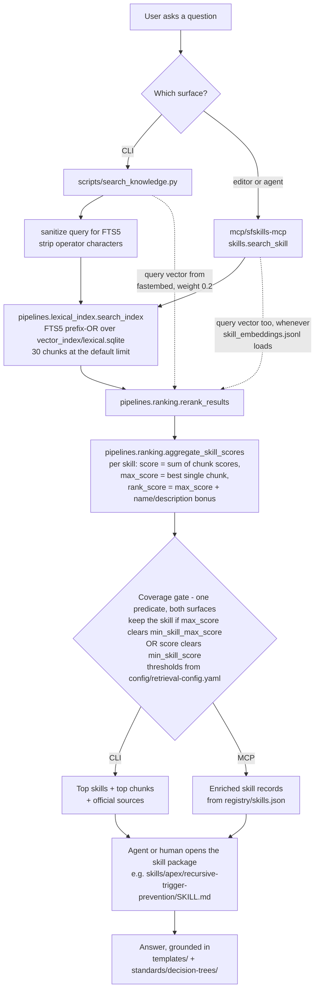
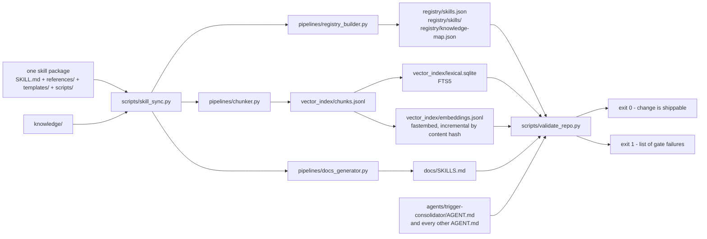

# Architecture

How the pieces fit together, what is written by a human, what is generated by
a script, and what path a question takes from "user asks" to "skill answers".

Read [glossary.md](glossary.md) first if terms like *chunk*, *coverage gate*
or *probe* are unfamiliar.

---

## The subsystems

Nine directories carry the whole system. Four are authored by hand, three are
generated and must never be hand-edited, two are code.

| Path | What it is | Written by | Read by |
|---|---|---|---|
| `skills/` | The corpus. One directory per skill: a `SKILL.md` with YAML frontmatter, plus `references/` (examples, gotchas, Well-Architected notes, LLM anti-patterns), optional `templates/` and `scripts/`. | Human | The sync engine, agents, every retrieval surface |
| `agents/` | Instruction files (`AGENT.md`) any agentic tool can follow. Each declares its skill, template and probe dependencies in frontmatter and cites them in Mandatory Reads. | Human | Runtime tools; `scripts/validate_repo.py` checks structure and citation resolution |
| `commands/` | Slash-command specs. Thin wrappers that collect inputs and hand off to one `AGENT.md`. Installed to `.claude/commands/` by `scripts/install_local_commands.py`. | Human | Claude Code and equivalents |
| `templates/` | Canonical cross-skill building blocks — the one `TriggerHandler`, `ApplicationLogger`, `SecurityUtils`, `TestDataFactory`, LWC skeleton, Flow fault path, Agentforce action shell. Skills link to these instead of inlining their own copies. | Human | Skills, agents, consuming projects |
| `standards/decision-trees/` | Routing logic consulted *before* a technology is chosen: automation selection, async tier, integration pattern, sharing mechanism. | Human | Agents and skills; cited by branch |
| `registry/` | Normalised machine-readable records: `registry/skills.json` (the whole corpus as one document), `registry/skills/` (one JSON per skill), `registry/knowledge-map.json`. | **Generated** | The MCP server, export targets, the count lint |
| `vector_index/` | Retrieval artifacts: `vector_index/chunks.jsonl` (chunk text), `vector_index/lexical.sqlite` (FTS5), `vector_index/embeddings.jsonl` (one 384-dim vector per chunk), `vector_index/skill_embeddings.jsonl` (one per skill), plus `vector_index/manifest.json`. All but the manifest and fixtures are gitignored. | **Generated** | Both retrieval surfaces |
| `evals/` | Output-quality tests. Golden P0 cases with assertions, rubrics and reference answers under `evals/golden/`, run by `evals/scripts/run_evals.py`. | Human | Nothing automatic today — see the caveat below |
| `mcp/sfskills-mcp` | The MCP server: 38 read-only tools over the corpus plus live-org metadata and read-only SOQL. Published to PyPI. | Human | MCP clients |

Two more directories are pure code: `pipelines/` holds the libraries
(chunking, lexical index, ranking, validators, sync engine) and `scripts/`
holds the CLI entrypoints that call them.

---

## Data flow: user asks, skill answers

### The four stages in words

**1. Lexical retrieval.** `pipelines/lexical_index.py` tokenises the query,
lowercases it, and turns each token into a prefix term joined by `OR`, then
runs it against an SQLite FTS5 table over every chunk. The table indexes
title, tags and text; everything else (chunk id, skill id, domain, path) is
stored unindexed. `retrieval.lexical_limit` in
`config/retrieval-config.yaml` caps this at 30 chunks. That cap is
zero-sum — a chunk admitted for one skill is a chunk denied to another.

The CLI additionally sanitises the query before this step, stripping
characters FTS5 treats as operators (`+`, `%`, `*`, `"` and friends). Without
it, a query like `100% test coverage` raises
`sqlite3.OperationalError: fts5: syntax error`.

**2. Rerank.** `pipelines/ranking.py` `rerank_results` blends the lexical
score with a cosine similarity against the query's embedding, at a vector
weight tuned to 0.2. When no query vector is supplied the vector term is zero
and the result is lexical-only.

**3. Skill aggregation.** `aggregate_skill_scores` collapses chunk hits into
skill hits. Each skill ends up with three numbers, and the distinction between
them is the single most important thing to understand about this system:

| Number | Meaning | Rewards |
|---|---|---|
| `score` | Cumulative sum of that skill's chunk scores | Breadth — many weak mentions |
| `max_score` | The single best chunk | Precision — one strong match |
| `rank_score` | `max_score` plus a bonus for query-token overlap with the skill's own name and description | Centrality — "this skill is *about* X" rather than "mentions X" |

The name/description bonus exists because chunk-level lexical scoring cannot
tell those two apart. Its weights live in `config/retrieval-config.yaml`
(`name_match_weight`, `description_match_weight`) and the tokeniser behind it
is deliberately fixed — the tuning is tied to that exact stopword set.

**4. Coverage gate.** Having found candidates, the system decides whether it
is confident enough to answer at all. Both surfaces compare the skill's
numbers against thresholds from `config/retrieval-config.yaml` —
`min_skill_score` (1.5) against the cumulative sum, `min_skill_max_score`
(1.0) against the best single chunk — and keep a skill if it clears *either*.
Skills that clear neither are suppressed: the CLI prints `Coverage: NONE` and
falls back to the official Salesforce sources it also returns; the MCP server
returns `has_coverage: false` with an empty `skills` list.

Note what is deliberately absent from that predicate: `rank_score`. The
name/description bonus is a *ranking* signal deciding which skill answers, not
a *confidence* signal deciding whether to answer, and folding it into the gate
would let a title coincidence manufacture coverage the corpus does not have.
Both implementations carry that reasoning as a comment
(`scripts/search_knowledge.py` `run_search`, `sfskills_mcp/skills.py`
`search_skill`).

The exact predicate is a tuning decision that has changed and will change
again; read it from `scripts/search_knowledge.py` rather than trusting any
prose, including this page. What does not change is the shape: a
*cumulative-sum* threshold and a *per-chunk-max* threshold are different
units, and mixing them up is how this system historically denied coverage it
had.

---

## The two surfaces do not share a code path

This is the most surprising thing in the architecture and it is worth stating
plainly: **the MCP server does not call `scripts/search_knowledge.py`.**

`mcp/sfskills-mcp/src/sfskills_mcp/skills.py` imports
`aggregate_skill_scores` and `rerank_results` from `pipelines` directly and
runs its own shorter pipeline.

Two implementations of the same idea is a standing drift risk, and they *have*
drifted before — until 2026-07-31 the MCP module set
`has_coverage = bool(results)` and never applied a threshold. That is closed:
both now build the gated list with the identical
`max_score >= min_skill_max_score or score >= min_skill_score` predicate,
reading the same `config/retrieval-config.yaml`. What remains different:

| | CLI (`scripts/search_knowledge.py`) | MCP (`sfskills_mcp.skills.search_skill`) |
|---|---|---|
| Coverage rule | `max_score >= min_skill_max_score or score >= min_skill_score` | **the same predicate, same config file** |
| Query sanitisation | `_sanitize_query_for_fts5` strips the query to alphanumerics and hyphens first | none — the raw query goes to `search_index` |
| Query vector | always computed | computed whenever `vector_index/skill_embeddings.jsonl` loads. It does on a repo checkout (994 vectors here). A PyPI install has neither vector file — `.gitignore` excludes them and the publish workflow bundles `vector_index/` from a bare checkout — so that install is lexical-only *by construction* |
| Chunk-level vectors | passes `vector_index/embeddings.jsonl` as a secondary source | passes `{}`. `rerank_results` prefers the skill vector when one exists, so this only bites on a chunk whose skill has no vector |
| Lexical window | `retrieval.lexical_limit` from config, 30 | `max(limit * 3, 30)` — a client asking for more than 10 results widens the window |
| Enrichment | official-source resolution, chunk snippets | registry metadata: name, category, description, tags, lifecycle status |
| Cost per query | seconds — loads `vector_index/embeddings.jsonl` and `vector_index/chunks.jsonl` on every invocation | milliseconds once the process is warm |

Consequences a user actually feels, all measured on this checkout on
2026-07-31:

- **Both surfaces deny coverage, on the same queries.**
  `search_skill("xylophone")` and `search_skill("photosynthesis chlorophyll")`
  each return `has_coverage: false` with zero skills, exactly as the CLI prints
  `Coverage: NONE`.
- **On a repo checkout the two agree numerically.** `"trigger recursion"`
  scores `apex/recursive-trigger-prevention` at 2.505 on both;
  `"why is my LWC slow"` scores `lwc/lwc-performance` at 2.507 on both.
  Expect divergence on a PyPI install, which has no vectors to blend.
- **Punctuation is the one behavioural difference left, and it is not
  graceful.** The MCP path passes FTS5 operator characters straight through:
  `search_skill("100% test coverage")` and `search_skill("salesforce + slack")`
  both raise `sqlite3.OperationalError: fts5: syntax error`. The CLI sanitises
  and answers. Strip punctuation client-side.
- **The MCP path is two to three orders of magnitude faster**, because it never
  reads the 535 MB chunk-embedding file.

Any change to the gate still has to be made in both places or the surfaces
drift apart again. `evals/measurement/check_cli_mcp_parity.py` now catches
that: it runs both surfaces over the same queries and fails on any difference
in the gated skill list or the `has_coverage` verdict. Run it with `--heldout`
to compare across all 154 held-out queries. It deliberately does *not* compare
payload shape (the MCP's registry enrichment is additive) or behaviour above
the default limit (the MCP widens its window by design). Note also that
`aggregate_skill_scores(ranked, bounded_limit)` is called positionally from
the MCP module, so new parameters on that function must stay optional.

---

## Build and sync: SKILL.md to generated artifacts

Authoring is one-directional. A human edits a skill package; one command
regenerates everything downstream; one command checks it.

- `python3 scripts/skill_sync.py --all` rebuilds everything;
  `--skill skills/<domain>/<name>` scopes it to one package;
  `--skip-embeddings` is what the pre-commit hook uses to stay fast.
- `python3 scripts/validate_repo.py` is the gate. Its full checklist, with
  file and line citations, is generated into
  [../standards/validation-gates.md](../standards/validation-gates.md).
  It includes a drift check: if a generated artifact does not match what the
  current sources would produce, that is an error.
- `python3 scripts/check_doc_counts.py` is a narrower lint that derives every
  corpus-scale number from `registry/skills.json` and the agent frontmatter,
  then asserts the docs quoting those numbers still agree.

Export is a separate one-way transform: `scripts/export_skills.py` reads the
same sources and writes tool-native trees (Cursor rules, Claude skills,
Windsurf, Aider conventions, Codex, the cross-tool `.agents` convention, and
an MCP-servable bundle). Parity between targets is contracted in
[multi-ai-parity.md](multi-ai-parity.md).

---

## Verification layers

Four independent layers, with honestly different strength:

| Layer | What it proves | Runs where |
|---|---|---|
| Structural validation (`scripts/validate_repo.py`) | Frontmatter present, required files present, citations resolve, generated artifacts current | Pre-commit hook and CI |
| Doc-count lint (`scripts/check_doc_counts.py`) | Every headline number in the docs matches the registry | CI |
| Org-backed harnesses | Probe SOQL executes, referenced fields and objects exist, agent dependencies resolve. See [validation/README.md](validation/README.md) | Manual, against a real org |
| Golden evals (`evals/golden/`) | Output quality against assertions and rubrics | Manual only |

Two honest caveats. CI runs the validator with the per-fixture
retrieval-quality assertion skipped, so retrieval regressions do not block a
merge today. And no workflow invokes `evals/scripts/run_evals.py`, so the
golden cases gate nothing. Both are known and tracked; see
[positioning.md](positioning.md).

---

## Authored vs generated, in one list

Edit freely: `skills/`, `agents/`, `commands/`, `templates/`,
`standards/`, `knowledge/`, `evals/`, `pipelines/`, `scripts/`,
`mcp/sfskills-mcp`, `config/retrieval-config.yaml`, `BACKLOG.yaml`.

Never hand-edit: `registry/`, `vector_index/`, `docs/SKILLS.md`,
`docs/queue-progress.md`, `standards/validation-gates.md`. The drift check
in `scripts/validate_repo.py` will catch you, and the fix is always to rerun
`python3 scripts/skill_sync.py --all` rather than to patch the artifact.
