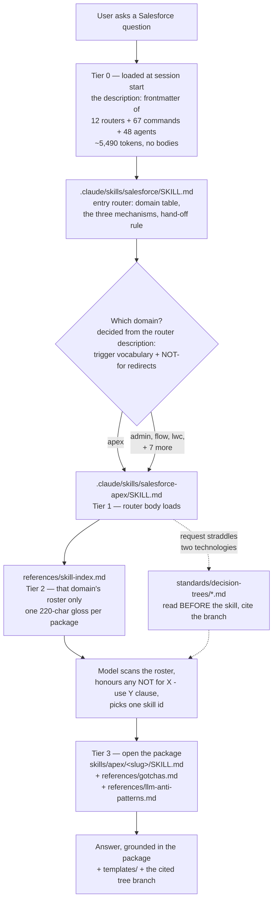
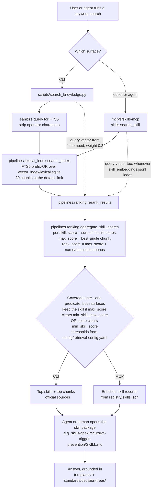
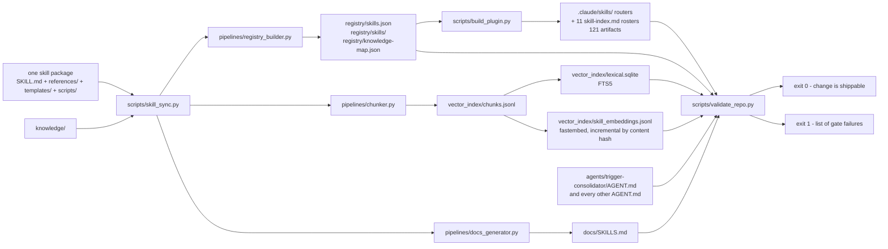

# Architecture

How the pieces fit together, what is written by a human, what is generated by
a script, and what path a question takes from "user asks" to "skill answers".

There are **three** ways a question reaches a skill package, and they are not
equally important:

1. **A model-driven roster scan.** No index, no build step, no API key. This is
   what a clone and a plugin install both use, and it is the only one that
   works out of the box.
2. **The MCP `search_skill` tool.** Needs the `sfskills-mcp` server connected,
   and a built index behind it.
3. **`scripts/search_knowledge.py`.** Needs a local `python3
   scripts/build_index.py` run first.

Mechanism 1 is documented first here, and at the same depth as the other two,
because for most readers it is the only one that ever runs. Earlier versions of
this page described the retrieval pipeline in careful detail and never once
named the roster scan — which meant the canonical "how it works" document
explained the code path most users never execute and omitted the one they do.

Read [glossary.md](glossary.md) first if terms like *gloss*, *roster*, *chunk*
or *coverage gate* are unfamiliar.

---

## Why the library is tiered

A skill library is only useful if the model can find the right page. The naive
way to make that happen is to put every skill's name and description in front
of the model at session start. At this corpus size that is not affordable.

Measured with `python3 scripts/build_plugin.py --measure`:

| what is loaded up front | components | tokens |
|---|---:|---:|
| Router skills | 12 | 1,921 |
| Slash commands | 67 | 1,412 |
| Run-time agents | 48 | 2,157 |
| **Total loaded before the user types anything** | | **5,490** |
| Budget | | 6,000 |
| *Alternative:* a flat export of every skill description | 1,027 | **138,334** |
| Ratio | | **4.01%** |

138k tokens of catalogue, spent before the first question, is the design this
architecture exists to avoid. Everything below — the router tier, the per-domain
rosters, the 220-character gloss budget — is downstream of that number.

That table measures a **plugin** install, where all three component types load.
A plain clone is cheaper still: `.claude/commands/` is gitignored, so until
`scripts/bootstrap.py` writes it, the 1,412 command tokens are not spent either.

The token model is an estimate, not a meter reading:
`0.25 * (len(qualified_name) + len(description)) + 0.25 per component`. It was
calibrated on 2026-08-07 against Claude Code 2.1.209 using nine probe plugins
installed from a local-path marketplace into a throwaway `CLAUDE_CONFIG_DIR`,
read back with `claude plugin details`. The full-replica probe predicted 6,117.8
against a measured 6,118. The `--measure` output carries a standing caveat with
it: that replica predates the 2026-08-07 gloss rework, so re-run the probe before
treating the current figure as validated. Say *estimated, calibrated* — not
*exact*.

---

## Mechanism 1: the model-driven roster scan

This is what ships. It needs nothing built, and it degrades to "the model reads
a markdown file" rather than to an error.

### What is actually in a clone

Tracked in git, present the moment `git clone` finishes:

| Path | Count | What it is |
|---|---:|---|
| `.claude/skills/salesforce/SKILL.md` | 1 | The top-level entry router |
| `.claude/skills/salesforce-<domain>/SKILL.md` | 11 | One domain router each |
| `.claude/skills/salesforce-<domain>/references/skill-index.md` | 11 | The rosters — one gloss per package |
| `.claude/agents/*.md` | 48 | Run-time agent loaders |
| `skills/<domain>/<slug>/` | 1,027 | The packages themselves |

Verify any of these against the default branch with `git ls-tree -r --name-only
origin/main .claude/skills/`. The rosters sum to exactly 1,027 glosses: admin
253, apex 158, architect 104, data 101, lwc 82, devops 70, flow 63, integration
61, agentforce 53, security 48, omnistudio 34.

Two things are **not** in a clone. `.claude/commands/` is gitignored
(`.gitignore:131`) and is written by `scripts/bootstrap.py`. And `vector_index/`
is gitignored except for three files — `git ls-files vector_index` returns only
`manifest.json`, `query-fixtures.json` and `query-variants.json`. **A fresh
clone has no FTS5 index and no embeddings**, which is exactly why mechanisms 2
and 3 cannot be the primary path.

### The path a question takes

### The four tiers in words

**Tier 0 — the descriptions, and only the descriptions.** What the host loads at
session start is the `description:` frontmatter of the 12 router skills, the 67
commands and the 48 agent loaders. No bodies. Each router description is a
deliberately engineered artifact and does three jobs at once: it states the
domain's scope, it lists trigger vocabulary in the phrasings a user actually
types, and it carries explicit negative routing. From
`.claude/skills/salesforce-apex/SKILL.md`:

> Owns calling an external API FROM Salesforce; salesforce-integration owns
> inbound. Generic nightly scheduling without naming code belongs to
> salesforce-flow. Codebase security review belongs to salesforce-security. NOT
> for SOSL — use salesforce-data.

Those disclaimers do more work than the positive keyword list. Domains overlap
heavily — a callout is Apex *and* integration, a sharing question is admin *and*
security — and without them the model routes on surface vocabulary and lands in
the wrong roster.

**Tier 1 — the router body.** Loading a router is not loading an answer; the
routers say so explicitly ("Answer from the opened package, never from this
router. It is a map, not the territory"). The body carries: a pointer to the
roster; the two search mechanisms and how to reach them; eight *featured entry
points* for when the request is too broad to route precisely; the decision
trees relevant to that domain; the canonical templates; the run-time agents
scoped to it; and four standing rules. One of those rules is the discipline that
keeps this path honest — *never claim a topic is uncovered without pasting
lookup output*.

**Tier 2 — the roster.** `references/skill-index.md` lists every package in that
domain with a one-line gloss, generated from `registry/skills.json` by
`scripts/build_plugin.py`. The gloss is where routing precision is won or lost,
so its composition is fixed and budgeted at 220 characters
(`MAX_GLOSS_CHARS`). The package id is already printed on the line, so the gloss
never repeats it. What it carries instead, in this order:

1. **Trigger vocabulary** — the phrasings that should land here.
2. **The `NOT for … use …` redirect**, naming the package to open instead.
3. A short scope phrase, if there is room.

Truncation is marked `…` and always falls at a word, keyword or whole-clause
boundary. The roster header states the rule plainly: *a `NOT for X - use Y`
clause is the most useful thing on the line* — if your question is X, stop and
open Y.

Crucially, Claude reads **one** roster, not eleven. An apex question costs the
apex roster's 158 glosses, not the corpus's 1,027.

**Tier 3 — the package.** The router sends the model to
`skills/<domain>/<slug>/SKILL.md` plus `references/gotchas.md` and
`references/llm-anti-patterns.md`. That is where the answer comes from.

### The asymmetry worth noticing: there is no coverage gate here

Mechanisms 2 and 3 can refuse to answer — they compute a score, compare it to a
threshold, and report `Coverage: NONE` when the corpus does not cover a query.
Mechanism 1 has no equivalent. A model scanning a roster always finds a
plausible-looking line, so the failure mode is not "no answer" but "confidently
the wrong package."

The architecture compensates with instructions rather than arithmetic: the
`NOT for X — use Y` redirects in every gloss, the negative routing in every
router description, and the rule forbidding an "uncovered" claim without pasted
lookup output. The routers also invert the fallback direction — if
`search_knowledge.py` errors or reports `Coverage: NONE`, the router tells the
model to fall back to mechanism 1 rather than tell the user the topic is
uncovered. Mechanism 1 is the floor, not the ceiling.

### How this path is measured, and one retraction

Router accuracy — which of the 12 routers gets opened — improved **88.3% →
96.1%** across the 2026-08-14 rewrite of the router descriptions, over 154
held-out queries. That metric is label-independent, and the wave did rewrite the
router descriptions, so the causal story holds.

The *package-level* headline first published from the same harness — "79.2% →
92.2% Hit@1" — **is retracted.** Two independent defects produced it. During
adjudication, 41 of the baseline run's 43 miss rows had their `expected` label
rewritten to whatever the baseline itself had picked, making the comparison
circular; and exact-match scoring charges the router for the corpus's own
near-duplicate pairs, where the "wrong" pick is defensible
(`security/mfa-enforcement-strategy` vs `security/mfa-enforcement-patterns`).
Re-scored against a single label set the direction inverts: 10 regressions, 0
improvements. The post-mortem and the rule it established — *never score a
corpus change against labels derived from a run of that same corpus* — are in
[../evals/measurement/README-model-routing.md](../evals/measurement/README-model-routing.md).

This benchmark does not run in CI. It needs live agents to do the routing, so
there is no cheap way to gate it on a pull request. What *is* gated is drift in
the artifacts the path depends on: `python3 scripts/build_plugin.py --check`
rebuilds all 121 plugin artifacts and fails on any mismatch, so a roster can
never silently fall behind `registry/skills.json`.

---

## The subsystems

Ten directories carry the whole system. Seven are authored by hand, three are
generated and must never be hand-edited.

| Path | What it is | Written by | Read by |
|---|---|---|---|
| `skills/` | The corpus. One directory per skill: a `SKILL.md` with YAML frontmatter, plus `references/` (examples, gotchas, Well-Architected notes, LLM anti-patterns), optional `templates/` and `scripts/`. | Human | The sync engine, agents, every retrieval surface |
| `.claude/skills/` | The router tier: 1 entry router, 11 domain routers, 11 generated rosters. This is mechanism 1's entire footprint. | **Generated** by `scripts/build_plugin.py` | Claude Code, directly, at session start |
| `agents/` | Instruction files (`AGENT.md`) any agentic tool can follow. Each declares its skill, template and probe dependencies in frontmatter and cites them in Mandatory Reads. | Human | Runtime tools; `scripts/validate_repo.py` checks structure and citation resolution |
| `commands/` | Slash-command specs. Thin wrappers that collect inputs and hand off to one `AGENT.md`. Installed to the gitignored `.claude/commands/` by `scripts/install_local_commands.py`. | Human | Claude Code and equivalents |
| `templates/` | Canonical cross-skill building blocks — the one `TriggerHandler`, `ApplicationLogger`, `SecurityUtils`, `TestDataFactory`, LWC skeleton, Flow fault path, Agentforce action shell. Skills link to these instead of inlining their own copies. | Human | Skills, agents, consuming projects |
| `standards/decision-trees/` | Routing logic consulted *before* a technology is chosen. Seven trees: automation selection, flow pattern, Agentforce capability, async tier, integration pattern, sharing mechanism, performance tuning. | Human | Agents and skills; cited by branch |
| `registry/` | Normalised machine-readable records: `registry/skills.json` (the whole corpus as one document), `registry/skills/` (one JSON per skill), `registry/knowledge-map.json`. Source of truth for both the rosters and the count lint. | **Generated** | The MCP server, export targets, `build_plugin.py`, the count lint |
| `vector_index/` | Mechanism 2/3 artifacts: `chunks.jsonl` (chunk text), `lexical.sqlite` (FTS5), `skill_embeddings.jsonl` (one vector per skill), optionally `embeddings.jsonl` (one per chunk), plus `manifest.json`. **All but the manifest and the two fixture files are gitignored** — nothing here ships. | **Generated** | The two search surfaces only |
| `evals/` | Output-quality tests. Golden P0 cases with assertions, rubrics and reference answers under `evals/golden/`; the retrieval and routing harnesses under `evals/measurement/`. | Human | Structure lints in CI; the scoring is manual |
| `mcp/sfskills-mcp` | The MCP server: 38 read-only tools over the corpus plus live-org metadata and read-only SOQL. Published to PyPI. | Human | MCP clients |

Two more directories are pure code: `pipelines/` holds the libraries
(chunking, lexical index, ranking, validators, sync engine) and `scripts/`
holds the CLI entrypoints that call them.

---

## Mechanisms 2 and 3: keyword search, after a local build

Everything below this line describes a code path that **does not run until
someone builds an index**. `vector_index/` is gitignored, so on a fresh clone
`search_knowledge.py` reports `Coverage: NONE` for every query and still exits
0 — which looks like an empty library rather than a missing index. Build it with
`python3 scripts/bootstrap.py`.

Who this path is really for: the build-time agents that maintain the library
(duplicate audits, coverage checks, gap analysis) and anyone who wants a second
opinion when mechanism 1 opens the wrong package. It is a good search engine.
It is not the product's front door.

Any accuracy figure below measures *this* path. It says nothing about mechanism
1, and conflating the two is how this repo has previously published a retrieval
number as though it were the routing quality a user experiences.

### Data flow

### The four stages in words

**1. Lexical retrieval.** `pipelines/lexical_index.py` tokenises the query,
lowercases it, and turns each token into a prefix term joined by `OR`, then
runs it against an SQLite FTS5 table over every chunk. The table indexes
title, tags and text; everything else (chunk id, skill id, domain, path) is
stored unindexed. `retrieval.lexical_limit` in
`config/retrieval-config.yaml` caps this at 30 chunks. That cap is
zero-sum — a chunk admitted for one skill is a chunk denied to another.

The CLI additionally sanitises the query before this step, stripping
characters FTS5 treats as operators (`+`, `%`, `*`, `"` and friends). Without
it, a query like `100% test coverage` raises
`sqlite3.OperationalError: fts5: syntax error`.

**2. Rerank.** `pipelines/ranking.py` `rerank_results` blends the lexical
score with a cosine similarity against the query's embedding, at a vector
weight tuned to 0.2. When no query vector is supplied the vector term is zero
and the result is lexical-only.

Whether a query vector exists at all is a matter of local install state, and the
repo has described it wrong more than once. `config/retrieval-config.yaml` sets
`embeddings.enabled: true`, but `fastembed` is commented out of
`requirements.txt:12`, so a plain `pip install -r requirements.txt` does not
install it and `pipelines/embedding_backends.py` logs a warning and falls back
to lexical-only. The accurate statement is: **embeddings are configured on and
inert until you install `fastembed` yourself.** They are neither opt-in behind a
flag nor on by default.

Installed, they are worth measuring rather than guessing. On 154 hand-written
held-out queries (`python3 evals/measurement/run_heldout.py --json`, versus
`--no-embeddings`, 2026-08-14):

| retrieval config | Hit@1 | Hit@3 | Coverage: NONE |
|---|---:|---:|---:|
| lexical-only | 39.6% | 48.1% | 0.0% |
| + `fastembed` skill vectors | **40.9%** | **53.9%** | 0.0% |

+1.3pp Hit@1, +5.8pp Hit@3. An earlier re-measurement in this repo concluded
they bought nothing measurable; that conclusion does not survive the held-out set
and is withdrawn. The 0% NONE rate is itself a change worth noting — a
2026-07-31 measurement on realistic phrasings recorded 23.3% NONE. Note that the
comment block in `config/retrieval-config.yaml` quotes an earlier run of the same
154 queries (36.4/44.2 → 37.0/48.7); the delta it reports is the same shape, the
absolute numbers move with the index. Re-run rather than quoting either.

Cost, on this checkout: `skill_embeddings.jsonl` is ~5 MB — 1,027 vectors, one
per skill, built by `python3 scripts/build_skill_embeddings.py` — on top of a
~289 MB lexical build. The ~535 MB figure that has appeared in this repo's docs
describes `embeddings.jsonl`, the chunk-level file, which the current pipeline
does not build and nothing loads.

**3. Skill aggregation.** `aggregate_skill_scores` collapses chunk hits into
skill hits. Each skill ends up with three numbers, and the distinction between
them is the single most important thing to understand about this system:

| Number | Meaning | Rewards |
|---|---|---|
| `score` | Cumulative sum of that skill's chunk scores | Breadth — many weak mentions |
| `max_score` | The single best chunk | Precision — one strong match |
| `rank_score` | `max_score` plus a bonus for query-token overlap with the skill's own name and description | Centrality — "this skill is *about* X" rather than "mentions X" |

The name/description bonus exists because chunk-level lexical scoring cannot
tell those two apart. Its weights live in `config/retrieval-config.yaml`
(`name_match_weight`, `description_match_weight`) and the tokeniser behind it
is deliberately fixed — the tuning is tied to that exact stopword set.

**4. Coverage gate.** Having found candidates, the system decides whether it
is confident enough to answer at all. Both surfaces compare the skill's
numbers against thresholds from `config/retrieval-config.yaml` —
`min_skill_score` (1.5) against the cumulative sum, `min_skill_max_score`
(1.0) against the best single chunk — and keep a skill if it clears *either*.
Skills that clear neither are suppressed: the CLI prints `Coverage: NONE` and
falls back to the official Salesforce sources it also returns; the MCP server
returns `has_coverage: false` with an empty `skills` list.

Note what is deliberately absent from that predicate: `rank_score`. The
name/description bonus is a *ranking* signal deciding which skill answers, not
a *confidence* signal deciding whether to answer, and folding it into the gate
would let a title coincidence manufacture coverage the corpus does not have.
Both implementations carry that reasoning as a comment
(`scripts/search_knowledge.py` `run_search`, `sfskills_mcp/skills.py`
`search_skill`).

The exact predicate is a tuning decision that has changed and will change
again; read it from `scripts/search_knowledge.py` rather than trusting any
prose, including this page. What does not change is the shape: a
*cumulative-sum* threshold and a *per-chunk-max* threshold are different
units, and mixing them up is how this system historically denied coverage it
had.

### The two surfaces do not share a code path

This is the most surprising thing in the search layer and it is worth stating
plainly: **the MCP server does not call `scripts/search_knowledge.py`.**

`mcp/sfskills-mcp/src/sfskills_mcp/skills.py` imports
`aggregate_skill_scores` and `rerank_results` from `pipelines` directly and
runs its own shorter pipeline.

Two implementations of the same idea is a standing drift risk, and they *have*
drifted before — until 2026-07-31 the MCP module set
`has_coverage = bool(results)` and never applied a threshold. That is closed:
both now build the gated list with the identical
`max_score >= min_skill_max_score or score >= min_skill_score` predicate,
reading the same `config/retrieval-config.yaml`. What remains different:

| | CLI (`scripts/search_knowledge.py`) | MCP (`sfskills_mcp.skills.search_skill`) |
|---|---|---|
| Coverage rule | `max_score >= min_skill_max_score or score >= min_skill_score` | **the same predicate, same config file** |
| Query sanitisation | `_sanitize_query_for_fts5` strips the query to alphanumerics and hyphens first | none — the raw query goes to `search_index` |
| Query vector | computed whenever either vector file loaded | computed whenever `vector_index/skill_embeddings.jsonl` loads. It does on a repo checkout with `fastembed` installed — 1,027 vectors, one per skill. A PyPI install has neither vector file — `.gitignore` excludes them and the publish workflow bundles `vector_index/` from a bare checkout — so that install is lexical-only *by construction* |
| Chunk-level vectors | still calls `load_embeddings(vector_index/embeddings.jsonl)`, but that file is not built in the current pipeline, so it loads an empty mapping | passes `{}`. `rerank_results` prefers the skill vector when one exists, so this only bites on a chunk whose skill has no vector |
| Lexical window | `retrieval.lexical_limit` from config, 30 | `max(limit * 3, 30)` — a client asking for more than 10 results widens the window |
| Enrichment | official-source resolution, chunk snippets | registry metadata: name, category, description, tags, lifecycle status |
| Cost per query | seconds — reads `chunks.jsonl` from disk on every invocation for official-source resolution | milliseconds once the process is warm |

Consequences a user actually feels, all measured on this checkout on
2026-07-31:

- **Both surfaces deny coverage, on the same queries.**
  `search_skill("xylophone")` and `search_skill("photosynthesis chlorophyll")`
  each return `has_coverage: false` with zero skills, exactly as the CLI prints
  `Coverage: NONE`.
- **On a repo checkout the two agree numerically.** `"trigger recursion"`
  scores `apex/recursive-trigger-prevention` at 2.505 on both;
  `"why is my LWC slow"` scores `lwc/lwc-performance` at 2.507 on both.
  Expect divergence on a PyPI install, which has no vectors to blend.
- **Punctuation is the one behavioural difference left, and it is not
  graceful.** The MCP path passes FTS5 operator characters straight through:
  `search_skill("100% test coverage")` and `search_skill("salesforce + slack")`
  both raise `sqlite3.OperationalError: fts5: syntax error`. The CLI sanitises
  and answers. Strip punctuation client-side.
- **The MCP path is two to three orders of magnitude faster**, because it never
  reads `chunks.jsonl`.

Any change to the gate still has to be made in both places or the surfaces
drift apart again. `evals/measurement/check_cli_mcp_parity.py` now catches
that: it runs both surfaces over the same queries and fails on any difference
in the gated skill list or the `has_coverage` verdict. CI runs it with
`--heldout`, across all 154 held-out queries (`.github/workflows/tests.yml`, the *CLI/MCP retrieval parity* step).
It deliberately does *not* compare payload shape (the MCP's registry enrichment
is additive) or behaviour above the default limit (the MCP widens its window by
design). Note also that `aggregate_skill_scores(ranked, bounded_limit)` is called
positionally from the MCP module, so new parameters on that function must stay
optional.

---

## Build and sync: SKILL.md to generated artifacts

Authoring is one-directional. A human edits a skill package; one command
regenerates everything downstream; one command checks it.

- `python3 scripts/skill_sync.py --all` rebuilds everything;
  `--skill skills/<domain>/<name>` scopes it to one package;
  `--skip-embeddings` is what the pre-commit hook uses to stay fast.
- `python3 scripts/build_plugin.py` regenerates the mechanism-1 tier from
  `registry/skills.json`. `--check` is the drift gate (121 artifacts);
  `--measure` prints the token budget. Both are read-only.
- `python3 scripts/validate_repo.py` is the gate. Its full checklist, with
  file and line citations, is generated into
  [../standards/validation-gates.md](../standards/validation-gates.md).
  It includes a drift check: if a generated artifact does not match what the
  current sources would produce, that is an error.
- `python3 scripts/check_doc_counts.py` is a narrower lint that derives every
  corpus-scale number from `registry/skills.json` and the agent frontmatter,
  then asserts the docs quoting those numbers still agree.

Note the ordering constraint this creates: a skill's `description` frontmatter
feeds `registry/skills.json`, which feeds its gloss in a roster, which is what
the model reads when deciding whether to open it. Editing a description is
editing routing behaviour, not just documentation.

Export is a separate one-way transform: `scripts/export_skills.py` reads the
same sources and writes tool-native trees (Cursor rules, Claude skills,
Windsurf, Aider conventions, Codex, the cross-tool `.agents` convention, and
an MCP-servable bundle). Parity between targets is contracted in
[multi-ai-parity.md](multi-ai-parity.md).

---

## Verification layers

Six layers, with honestly different strength:

| Layer | What it proves | Runs where |
|---|---|---|
| Structural validation (`scripts/validate_repo.py`) | Frontmatter present, required files present, citations resolve, generated artifacts current | Pre-commit hook and CI, 4 shards |
| Query fixtures (1,356) | A curated query still returns its expected skill | CI, inside the skill shards |
| Doc-count lint (`scripts/check_doc_counts.py`) | Every headline number in the docs matches the registry | CI |
| Plugin drift (`scripts/build_plugin.py --check`) | The 121 mechanism-1 artifacts match a fresh build | Manual and pre-ship |
| Org-backed harnesses | Probe SOQL executes, referenced fields and objects exist, agent dependencies resolve. See [validation/README.md](validation/README.md) | Manual, against a real org |
| Golden evals (`evals/golden/`) | *Structure* of the P0 cases. Not their output quality | Structure lint in CI; scoring is manual |

What CI actually gates, verified against `.github/workflows/`:

| gate | in CI? | where |
|---|---|---|
| `validate_repo.py --skills-only`, 4 shards | yes | `validate.yml`, `validate-skills` job |
| `validate_repo.py --agents` | yes | `validate.yml`, `validate-agents` job |
| Query fixtures (1,356) | yes, inside the skill shards | `validate.yml`, `validate-skills` job |
| Golden eval **structure** lint | yes | `validate.yml`, `evals` job |
| Agent eval structure lint | yes | `validate.yml`, `evals` job |
| CLI/MCP retrieval parity, held-out | yes | `tests.yml`, *CLI/MCP retrieval parity* step |
| Export parity, cross-OS | yes | `validate.yml`, `export-parity-matrix` job; `pr-lint.yml` |
| Unit tests | yes | `tests.yml`, both `unittest discover` steps |
| `run_heldout.py` Hit@1/Hit@3 thresholds | **no** | not referenced by any workflow |
| Model-routing benchmark (mechanism 1) | **no** | needs live agents |
| Live-org probes and factuality | separate workflow | `org-validation.yml` |

The honest caveat, stated at its real size: golden eval **structure** is
enforced, but nothing in CI scores eval **output quality** against its rubric.
The fixture gate runs, but neither the held-out retrieval thresholds nor the
model-routing benchmark does. See [positioning.md](positioning.md).

Coverage shape matters as much as the gate list. There are golden evals for 10
of 1,027 packages — 1.0%, spread across 4 of 11 domains (apex 4, integration 3,
lwc 2, flow 1). `admin` is the largest domain at 253 skills and has none, as do
`data`, `security`, `devops`, `architect`, `agentforce` and `omnistudio`.

---

## Authored vs generated, in one list

Edit freely: `skills/`, `agents/`, `commands/`, `templates/`,
`standards/`, `knowledge/`, `evals/`, `pipelines/`, `scripts/`,
`mcp/sfskills-mcp`, `config/retrieval-config.yaml`, `BACKLOG.yaml`.

Never hand-edit: `registry/`, `vector_index/`, `.claude/skills/`,
`.claude/agents/`, `docs/SKILLS.md`, `docs/queue-progress.md`,
`standards/validation-gates.md`. The drift checks in
`scripts/validate_repo.py` and `scripts/build_plugin.py --check` will catch
you, and the fix is always to rerun `python3 scripts/skill_sync.py --all` or
`python3 scripts/build_plugin.py` rather than to patch the artifact.
