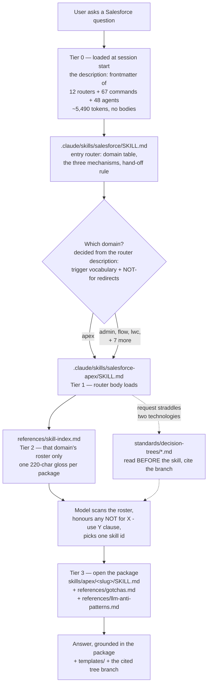
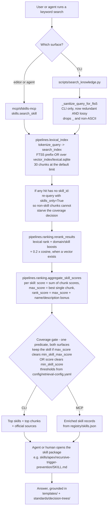
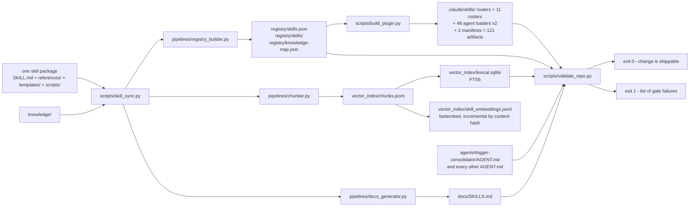

# Architecture

How the pieces fit together, what a human writes, what a script generates, and
what path a question takes from "user asks" to "skill answers".

Every number and file:line citation on this page was re-verified against this
checkout on **2026-08-15**. Where a figure moves with the corpus, the command
that produced it is printed next to it — re-run it rather than trusting the
number.

## Start here: only one retrieval mechanism ships

There are three ways a question reaches a skill package. They are not equally
important, and the ordering below is the order of what real installs actually
have:

| # | Mechanism | Setup required | Ships? |
|---|---|---|---|
| **1** | **Model-driven roster scan** — Claude reads router descriptions, opens one `references/skill-index.md`, picks a package by name | **none** | **yes — this is the product's front door** |
| 2 | MCP `search_skill` tool | connect the `sfskills-mcp` server *by hand*, and build an index | server code ships; the wiring does not |
| 3 | `scripts/search_knowledge.py` | `python3 scripts/build_index.py` locally | script ships; its index does not |

Two facts make that ordering non-negotiable, and both are one command away.

**`vector_index/` is gitignored.** A fresh clone and a plugin install both have
zero search index and zero embeddings:

```console
$ git ls-files vector_index
vector_index/manifest.json
vector_index/query-fixtures.json
vector_index/query-variants.json
```

Three fixture/metadata files. No `lexical.sqlite`, no `chunks.jsonl`, no
`skill_embeddings.jsonl`. Mechanisms 2 and 3 cannot be the primary path because
on most installs they have nothing to read.

**The MCP server is not auto-wired.** `.claude-plugin/plugin.json` declares
`skills` and `commands` and nothing else:

```console
$ python3 -c "import json;d=json.load(open('.claude-plugin/plugin.json'));print('mcpServers' in d)"
False
```

Installing the plugin does not connect the MCP server. A user has to do that
themselves.

**What does ship** is 23 tracked files:

```console
$ git ls-files .claude/skills | wc -l
      23
```

One entry router, 11 domain routers, 11 rosters. That is mechanism 1's entire
footprint, and it is the code path this page documents first and at the most
depth — because for most readers it is the only one that ever runs.

Read [glossary.md](glossary.md) first if terms like *gloss*, *roster*, *chunk*
or *coverage gate* are unfamiliar.

---

## Why the library is tiered at all

A skill library is only useful if the model can find the right page. The naive
way to make that happen is to put every skill's name and description in front of
the model at session start. At this corpus size that is not affordable.

Measured with `python3 scripts/build_plugin.py --measure` on 2026-08-15:

| what is loaded up front | components | tokens |
|---|---:|---:|
| Router skills | 12 | 1,921.0 |
| Slash commands | 67 | 1,412.0 |
| Run-time agents | 48 | 2,157.2 |
| **Total loaded before the user types anything** (`tier1_tokens`) | | **5,490** |
| Budget (`budget_tier1_tokens`) | | 6,000 |
| *Alternative:* a flat export of every skill description | 1,027 | **138,694** |
| Ratio | | **3.96%** |

139k tokens of catalogue, spent before the first question, is the design this
architecture exists to avoid. Everything below — the router tier, the per-domain
rosters, the 220-character gloss budget — is downstream of that number.

That table measures a **plugin** install, where all three component types load;
`plugin.json` points `commands` at the tracked `commands/` directory, so the
1,412 command tokens are real there. A plain clone is cheaper: Claude Code reads
slash commands from `.claude/commands/`, which is gitignored, so until
`scripts/bootstrap.py` writes it those tokens are not spent.

```console
$ git check-ignore -v .claude/commands/
.gitignore:131:.claude/*	.claude/commands/
```

The token model is an **estimate, calibrated** — not a meter reading:
`0.25 * (len(qualified_name) + len(description)) + 0.25 per component`. It was
calibrated on 2026-08-07 against Claude Code 2.1.209 using nine probe plugins
installed from a local-path marketplace into a throwaway `CLAUDE_CONFIG_DIR`,
read back with `claude plugin details`; the full-replica probe predicted 6,117.8
against a measured 6,118. `--measure` carries that provenance in its
`measured_reference` block *along with its own caveat*: the replica predates the
2026-08-07 gloss rework, so re-run the probe before calling the current figure
validated.

---

## Mechanism 1: the model-driven roster scan

This is what ships. It needs nothing built, and it degrades to "the model reads
a markdown file" rather than to an error.

### What is actually in a clone

Tracked in git, present the moment `git clone` finishes:

| Path | Count | Verify with | What it is |
|---|---:|---|---|
| `.claude/skills/salesforce/SKILL.md` | 1 | `git ls-files .claude/skills` | The top-level entry router |
| `.claude/skills/salesforce-<domain>/SKILL.md` | 11 | same | One domain router each |
| `.claude/skills/salesforce-<domain>/references/skill-index.md` | 11 | same | The rosters — one gloss per package |
| `.claude/agents/*.md` | 48 | `git ls-files .claude/agents \| wc -l` | Run-time agent loaders (plugin-scoped) |
| `agents/<id>.md` | 48 | `git ls-files agents/ \| grep -c '^agents/[^/]*\.md$'` | Byte-identical project-scoped copies of the same loaders |
| `commands/*.md` | 67 | `git ls-files 'commands/*.md' \| wc -l` | Slash-command specs, loaded by the plugin from here |
| `skills/<domain>/<slug>/` | 1,027 | `git ls-files 'skills/*/*/SKILL.md' \| wc -l` | The packages themselves |

The rosters sum to exactly 1,027 glosses — admin 253, apex 158, architect 104,
data 101, lwc 82, devops 70, flow 63, integration 61, agentforce 53, security 48,
omnistudio 34 (`registry/skills.json`, `domain_counts`).

Two things are **not** in a clone: `.claude/commands/` (gitignored, written by
`scripts/bootstrap.py`) and the bulk of `vector_index/` (see the top of this
page). **A fresh clone has no FTS5 index and no embeddings.**

### The path a question takes



### The four tiers in words

**Tier 0 — the descriptions, and only the descriptions.** What the host loads at
session start is the `description:` frontmatter of the 12 router skills, the 67
commands and the 48 agent loaders. No bodies. Each router description is a
deliberately engineered artifact doing three jobs at once: it states the domain's
scope, it lists trigger vocabulary in the phrasings a user actually types, and it
carries explicit negative routing. Verbatim, from
`.claude/skills/salesforce-apex/SKILL.md`:

> Owns calling an external API FROM Salesforce; salesforce-integration owns
> inbound. Generic nightly scheduling without naming code belongs to
> salesforce-flow. Codebase security review belongs to salesforce-security. NOT
> for SOSL — use salesforce-data.

Those disclaimers do more work than the positive keyword list. Domains overlap
heavily — a callout is Apex *and* integration, a sharing question is admin *and*
security — and without them the model routes on surface vocabulary and lands in
the wrong roster.

**Tier 1 — the router body.** Loading a router is not loading an answer, and
every router says so twice: once in prose (*"Do not answer from this router: it
is a map, not the territory."*) and once as rule 1 (*"Answer from the opened
`apex` package, never from this router."*). The body carries: a pointer to the
roster; all three mechanisms in the order given at the top of this page; exactly
**8** *featured entry points* for when the request is too broad to route
precisely; the decision trees relevant to that domain; the canonical templates;
the run-time agents scoped to it; and exactly **4** standing rules. One of those
rules is the discipline that keeps this path honest — *"Never claim a topic is
uncovered without pasting lookup output."* (Verified identical across all 11
domain routers: 8 featured entries, 4 rules each.)

**Tier 2 — the roster.** `references/skill-index.md` lists every package in that
domain with a one-line gloss, generated from `registry/skills.json` by
`scripts/build_plugin.py`. The next section covers how a gloss is built, because
that is where routing precision is won or lost.

Crucially, Claude reads **one** roster, not eleven. An apex question costs the
apex roster's 158 glosses, not the corpus's 1,027.

**Tier 3 — the package.** The router sends the model to
`skills/<domain>/<slug>/SKILL.md` plus `references/gotchas.md` and
`references/llm-anti-patterns.md`. That is where the answer comes from.

### How a gloss is built — the mechanism that decides routing

`build_gloss()` (`scripts/build_plugin.py:979`) is the highest-leverage function
in the repository: it is the only thing that decides what vocabulary reaches the
surface a shipped install actually reads. Its constants:

| Constant | Value | Line | What it bounds |
|---|---:|---:|---|
| `MAX_GLOSS_CHARS` | 220 | `scripts/build_plugin.py:281` | The whole gloss |
| `GLOSS_TRIGGER_CAP` | 150 | `scripts/build_plugin.py:287` | The trigger list alone |
| `GLOSS_NOTFOR_CAP` | 140 | `scripts/build_plugin.py:288` | The `NOT for …` clauses alone |
| `GLOSS_LEAD_CAP` | 150 | `scripts/build_plugin.py:289` | The lead phrase alone |
| `GLOSS_LEAD_MIN` | 40 | `scripts/build_plugin.py:292` | Below this the lead is dropped outright, not shipped as a stub |
| `GLOSS_ELLIPSIS` | `…` | `scripts/build_plugin.py:295` | The truncation marker |

**Its input is the `description` string, not the `triggers:` YAML block.** This
distinction is the single most common misreading of this system. The call site is:

```python
# scripts/build_plugin.py:1349
        gloss = build_gloss(skill.get("description", ""))
```

`split_description()` (`scripts/build_plugin.py:860`) then cuts that one string
into three parts using `_TRIGGER_RE` (`:852`, matching `Triggers:` /
`Trigger keywords:` / `Trigger phrases:`) and `_NOTFOR_RE` (`:857`, matching
`NOT for` only at a sentence start). A skill's frontmatter `triggers:` list is a
**different list entirely** — it is consumed by `pipelines/sync_engine.py:104`
(chunk indexing) and `pipelines/similarity.py` (duplicate detection), and it does
not appear in `registry/skills.json` at all. Worked proof on one package:

```console
$ python3 -c "import json;s=[x for x in json.load(open('registry/skills.json'))['skills'] if x['id']=='apex/recursive-trigger-prevention'][0];print(sorted(s.keys()))"
['category', 'chunk_ids', 'content_hash', 'dependencies', 'description', 'file_location', 'id', 'inputs', 'name', 'official_sources', 'outputs', 'references', 'scripts', 'status', 'tags', 'templates', 'updated', 'vector_embedding', 'version']
```

No `triggers` key. For that same package the frontmatter `triggers:` list starts
`"how do I prevent recursive Apex triggers"`, while the `Triggers:` clause inside
its `description` reads `'trigger recursion', 'static boolean guard', …`. Adding
a phrase to the YAML block changes chunk-level search; it does not change routing.

**Two different orders, and confusing them is a bug.**

*Budget priority* — who gets paid first — is **triggers → NOT-for redirect →
lead**, with the lead paid out of whatever is left
(`scripts/build_plugin.py:989-1008`). The measurement behind that order is in the
comment block at `scripts/build_plugin.py:245-280`: paying the lead last keeps
54% of full trigger lists and 67% of cross-references, against 25%/38% when the
lead is paid first.

*Print order* on the line is **lead → `Triggers: …` → `NOT for …`**
(`scripts/build_plugin.py:1010-1017`). The roster header describes the priority
order, so a reader who takes it as the printed order will be surprised.

A worked example that shows the budget actually biting:

```console
$ python3 -c "
import importlib.util,json
spec=importlib.util.spec_from_file_location('bp','scripts/build_plugin.py')
bp=importlib.util.module_from_spec(spec); spec.loader.exec_module(bp)
s=[x for x in json.load(open('registry/skills.json'))['skills'] if x['id']=='apex/recursive-trigger-prevention'][0]
g=bp.build_gloss(s['description']); print(g); print('len',len(g))"
Triggers: 'trigger recursion', 'static boolean guard', 'recursive update', 'self DML', 'trigger firing multiple times'. NOT for how to structure the trigger handler itself — use apex/trigger-framework.
len 201
```

The lead ("debugging or preventing recursive Apex trigger behavior — self-DML,
static guard flaws, …") was written by a human and **does not ship**. The
triggers and the first redirect consumed the budget; the second `NOT for` clause
was dropped too. That is normal and intended, and it is why prose added to a
description's lead is usually invisible to routing.

**Truncation drops whole units, so order inside a list decides survival.**
`_clip_keywords()` (`scripts/build_plugin.py:891`) splits the trigger list on
commas and keeps whole keywords until the budget runs out, then appends `, …`.
It never cuts mid-phrase, because a half phrase is unmatchable. The consequence
for authors: **the order you write triggers in is the order they survive in.**
Put the phrasings you most want to route first. Similarly
`_clip_clauses()` (`:933`) keeps `NOT for …` clauses whole or drops them whole,
and when even the first clause overflows it re-attaches the `use <target>` tail
(`_redirect_target()`, `:925`) so a reader never gets a destination they cannot
resolve. `_clip_words()` (`:881`) is the word-boundary fallback.

**Checking whether a term reaches the surface.**
`scripts/check_gloss_coverage.py` (added this session) answers the question that
silently sank previous content waves: *did the vocabulary we just wrote actually
land in the shipped roster?*

```console
$ python3 scripts/check_gloss_coverage.py subagent --domain agentforce
'subagent' in agentforce: reaches the shipped roster in 4 package(s).

Mentioned in lead prose only, not routed (4) — usually correct, listed for review:
  agentforce/agentforce-cost-optimization
  agentforce/agentforce-multi-turn-patterns
  agentforce/agentforce-prompt-versioning
  agentforce/agentforce-testing-strategy
...
```

It buckets every package into *routed* (term is in the gloss), *clipped*
(declared in the description's `Triggers:` clause but lost to the 220-char cap),
*lead prose only*, and *body only*. **Only `clipped` is a defect** — it exits 1
on that alone, so it can gate a wave. A term that merely appears in a body is
normal, and the script's own comment records why promoting those is harmful:
appending vocabulary to chase body matches has already cost this repo 5pp of
retrieval accuracy once.

### The asymmetry worth noticing: there is no coverage gate here

Mechanisms 2 and 3 can refuse to answer — they compute a score, compare it to a
threshold, and report `Coverage: NONE` when the corpus does not cover a query.
Mechanism 1 has no equivalent. A model scanning a roster always finds a
plausible-looking line, so the failure mode is not "no answer" but "confidently
the wrong package."

The architecture compensates with instructions rather than arithmetic: the
`NOT for X — use Y` redirects in every gloss, the negative routing in every
router description, and the rule forbidding an "uncovered" claim without pasted
lookup output. The routers also invert the fallback direction — if
`search_knowledge.py` errors or reports `Coverage: NONE`, the router tells the
model to *"fall back to mechanism 1 rather than telling the user the topic is
uncovered."* Mechanism 1 is the floor, not the ceiling.

### How this path is measured, and one retraction

Router accuracy — which of the 12 routers gets opened — improved **88.3% →
96.1%** across the 2026-08-14 rewrite of the router descriptions, over 154
held-out queries. That metric is label-independent, and the wave did rewrite the
router descriptions, so the causal story holds.

The *package-level* headline first published from the same harness **is
retracted, and its figures should not be repeated.** Two independent defects
produced it. During adjudication, 41 of the baseline run's 43 miss rows had their
`expected` label rewritten to whatever the baseline itself had picked, making the
comparison circular; and exact-match scoring charges the router for the corpus's
own near-duplicate pairs, where the "wrong" pick is defensible
(`security/mfa-enforcement-strategy` vs `security/mfa-enforcement-patterns`).
Re-scored against a single label set the direction **inverts** — excluding the 20
relabelled queries, 98.5% before against 92.5% after, a query-level diff of 10
regressions and 0 improvements.

The post-mortem and the rule it established — *never score a corpus change
against labels derived from a run of that same corpus* — are in
[../evals/measurement/README-model-routing.md](../evals/measurement/README-model-routing.md).
Read it before citing any routing number.

This benchmark does not run in CI. It needs live agents to do the routing, so
there is no cheap way to gate it on a pull request. What *is* gated is drift in
the artifacts the path depends on:

```console
$ python3 scripts/build_plugin.py --check
OK: 121 plugin artifact(s) match a fresh build — no drift
```

Those 121 are 23 files under `.claude/skills/`, 48 under `.claude/agents/`, the
48 byte-identical `agents/<id>.md` project-scoped copies, and the two manifests
in `.claude-plugin/`. A roster can never silently fall behind
`registry/skills.json`.

---

## The subsystems

Ten directories carry the whole system. Seven are authored by hand, three are
generated and must never be hand-edited.

| Path | What it is | Written by | Read by |
|---|---|---|---|
| `skills/` | The corpus. One directory per skill: a `SKILL.md` with YAML frontmatter, plus `references/` (examples, gotchas, Well-Architected notes, LLM anti-patterns), optional `templates/` and `scripts/`. 1,027 packages, all five required files present in every one. | Human | The sync engine, agents, every retrieval surface |
| `.claude/skills/` | The router tier: 1 entry router, 11 domain routers, 11 generated rosters. This is mechanism 1's entire footprint. | **Generated** by `scripts/build_plugin.py` | Claude Code, directly, at session start |
| `agents/` | Instruction files (`AGENT.md`) any agentic tool can follow — 76 of them: 48 active run-time, 14 build-time, 14 deprecated stubs. Each declares its skill, template and probe dependencies in frontmatter and cites them in Mandatory Reads. | Human (the flat `agents/<id>.md` loaders are generated) | Runtime tools; `scripts/validate_repo.py` checks structure and citation resolution |
| `commands/` | 67 slash-command specs. Thin wrappers that collect inputs and hand off to one `AGENT.md`. The plugin loads them from here; `scripts/install_local_commands.py` also copies them to the gitignored `.claude/commands/` for plain clones. | Human | Claude Code and equivalents |
| `templates/` | 73 tracked files of canonical cross-skill building blocks — the one `TriggerHandler`, `ApplicationLogger`, `SecurityUtils`, `TestDataFactory`, LWC skeleton, Flow fault path, Agentforce action shell. Skills link to these instead of inlining their own copies. | Human | Skills, agents, consuming projects |
| `standards/decision-trees/` | Routing logic consulted *before* a technology is chosen. Seven trees: automation selection, flow pattern, Agentforce capability, async tier, integration pattern, sharing mechanism, performance tuning. | Human | Agents and skills; cited by branch |
| `registry/` | Normalised machine-readable records: `registry/skills.json` (the whole corpus as one document, `skill_count: 1027`), `registry/skills/` (one JSON per skill), `registry/knowledge-map.json`, `registry/export_manifest.json`. Source of truth for the rosters and the count lint. | **Generated** | The MCP server, export targets, `build_plugin.py`, the count lint |
| `vector_index/` | Mechanism 2/3 artifacts: `chunks.jsonl` (chunk text), `lexical.sqlite` (FTS5), `skill_embeddings.jsonl` (one vector per skill), plus `manifest.json` and the query fixtures. **Everything except the manifest and the two fixture files is gitignored** — nothing large here ships. | **Generated** | The two search surfaces only |
| `evals/` | Output-quality tests. Golden P0 cases with assertions, rubrics and reference answers under `evals/golden/`; the retrieval and routing harnesses under `evals/measurement/`. | Human | Structure lints in CI; the scoring is manual |
| `mcp/sfskills-mcp` | The MCP server: 38 read-only tools over the corpus plus live-org metadata and read-only SOQL. Version 0.4.7; published to PyPI. | Human | MCP clients |

Two more directories are pure code: `pipelines/` holds the libraries (chunking,
lexical index, ranking, validators, sync engine) and `scripts/` holds the CLI
entrypoints that call them.

---

## Mechanisms 2 and 3: keyword search, after a local build

Everything below this line describes a code path that **does not run until
someone builds an index**. On a fresh clone `search_knowledge.py` reports
`Coverage: NONE` for every query and still exits 0 — which looks like an empty
library rather than a missing index. Build it with `python3 scripts/bootstrap.py`.

Who this path is really for: the build-time agents that maintain the library
(duplicate audits, coverage checks, gap analysis) and anyone who wants a second
opinion when mechanism 1 opens the wrong package. It is a good search engine. It
is not the product's front door.

Any accuracy figure below measures *this* path. It says nothing about mechanism
1, and conflating the two is how this repo has previously published a retrieval
number as though it were the routing quality a user experiences.

### Data flow



### The five stages in words

**1. Lexical retrieval.** `tokenize_query` (`pipelines/lexical_index.py:51`)
replaces every character FTS5 will not accept inside a bareword with whitespace,
lowercases what is left, and joins the tokens as prefix terms with `OR`; the
result runs against an SQLite FTS5 table over every chunk
(`search_index`, `:130`). The table indexes title, tags and text; everything else
(chunk id, skill id, domain, path) is stored unindexed.
`retrieval.lexical_limit` in `config/retrieval-config.yaml` caps this at **30**
chunks. That cap is zero-sum — a chunk admitted for one skill is a chunk denied
to another.

The bareword predicate is deliberately explicit rather than a regex class
(`_is_fts5_bareword_char`, `:38`): ASCII alphanumerics, underscore, and any
codepoint above 127, so `with_sharing` survives as one token and `café*` stays a
legal query. Hyphen and slash are excluded on purpose, because splitting
`apex/trigger-framework` into three prefix terms is what makes a pasted skill id
reach the index.

**This is the layer that fixes FTS5 injection and syntax crashes, and it is
shared.** A query like `100% test coverage` or `salesforce + slack` used to raise
`sqlite3.OperationalError: fts5: syntax error`; it no longer does on either
surface. The CLI's older `_sanitize_query_for_fts5`
(`scripts/search_knowledge.py:286`) still runs first, but it is now redundant
belt-and-braces — and lossier than the shared tokeniser, which is a live defect
rather than a design (see the surface-comparison table below).

**2. The skills-only second window.** Chunks with no `skill_id` — knowledge
imports, official-source chunks — can never aggregate into a skill, so they spend
window slots without being able to answer the question. Both surfaces now detect
that case and re-query with `skills_only=True`
(`scripts/search_knowledge.py:337-343`,
`mcp/.../skills.py:233-243`), reusing the first result when it is already
all-skill so the common query pays nothing extra. The measurement in those
comments: non-skill chunks take 7.5% of the window overall, but took 20 of 30
slots on *"set up single sign on"* and 24 of 30 on *"share data between two
lightning web components"* — both of which returned no coverage while the owning
skill sat in the index.

**3. Rerank.** `rerank_results` (`pipelines/ranking.py:84`) scores each hit as:

```python
# pipelines/ranking.py:115-128
        lexical_score = 1.0 / (1.0 + index)
        ...
            boost += 0.2          # hit is in the requested --domain
        ...
            boost += 0.1          # hit belongs to a skill at all
        ...
        total_score = lexical_score + boost + (0.2 * vector_score)
```

The vector weight of **0.2** is hard-coded, not configurable; the sweep behind it
is recorded in `config/retrieval-config.yaml` (0.35 regressed natural-language
Hit@1 by 4pp, 0.10 bought nothing). When no query vector is supplied the vector
term is zero and the result is lexical-only. `rerank_results` prefers the
skill-level vector and falls back to the chunk-level one
(`pipelines/ranking.py:122-127`).

Whether a query vector exists at all is a matter of local install state, and the
repo has described it wrong more than once. `config/retrieval-config.yaml` sets
`embeddings.enabled: true`, but `fastembed` is commented out of
`requirements.txt:12`, so a plain `pip install -r requirements.txt` does not
install it and `pipelines/embedding_backends.py` logs a warning and falls back to
lexical-only. The accurate statement is: **embeddings are configured on and inert
until you install `fastembed` yourself.** They are neither opt-in behind a flag
nor on by default. Both surfaces additionally skip embedding the query when no
vector file loaded (`scripts/search_knowledge.py:318-319`), so turning the flag
on cannot cost an install that has nothing to compare against.

Installed, they are worth measuring rather than guessing. Measured on this
checkout on **2026-08-15**, over the 154 hand-written held-out queries:

```console
$ python3 evals/measurement/run_heldout.py --json               # embeddings on
$ python3 evals/measurement/run_heldout.py --no-embeddings --json
```

| retrieval config | Hit@1 | Hit@3 | Coverage: NONE |
|---|---:|---:|---:|
| lexical-only | 39.0% | 48.7% | 0.0% |
| + `fastembed` skill vectors | **40.3%** | **53.9%** | 0.0% |

+1.3pp Hit@1, +5.2pp Hit@3. An earlier re-measurement in this repo concluded
embeddings bought nothing measurable; that conclusion does not survive the
held-out set and is withdrawn. The 0% NONE rate is itself a change worth noting —
a 2026-07-31 measurement on realistic phrasings recorded 23.3% NONE. The comment
block in `config/retrieval-config.yaml` quotes earlier runs of the same 154
queries (36.4/44.2 → 37.0/48.7 on 2026-08-13; 39.6/48.1 → 40.9/53.9 on
2026-08-14). The delta keeps its shape; the absolute numbers move with the
corpus. **Re-run rather than quoting any of them.**

Cost, on this checkout (`ls -la vector_index/`, `du -sh vector_index/`,
2026-08-15): `skill_embeddings.jsonl` is 5.0 MB — 1,027 vectors, one per skill,
built by `python3 scripts/build_skill_embeddings.py` — on top of a 127 MB
`chunks.jsonl` and a 169 MB `lexical.sqlite`, 301 MB for the directory. The
~535 MB figure that has appeared in this repo's docs describes
`embeddings.jsonl`, the chunk-level file, which the current pipeline does not
build and nothing loads (`vector_index/manifest.json` records
`"embedding_count": 0`).

**4. Skill aggregation.** `aggregate_skill_scores`
(`pipelines/ranking.py:141`) collapses chunk hits into skill hits. Each skill
ends up with three numbers, and the distinction between them is the single most
important thing to understand about this system:

| Number | Meaning | Rewards |
|---|---|---|
| `score` | Cumulative sum of that skill's chunk scores | Breadth — many weak mentions |
| `max_score` | The single best chunk | Precision — one strong match |
| `rank_score` | `max_score` plus a bonus for query-token overlap with the skill's own name and description (`pipelines/ranking.py:198`) | Centrality — "this skill is *about* X" rather than "mentions X" |

The name/description bonus exists because chunk-level lexical scoring cannot tell
those two apart. Its weights live in `config/retrieval-config.yaml`
(`name_match_weight: 1.5`, `description_match_weight: 0.5`) and the tokeniser
behind it is deliberately fixed — the tuning is tied to that exact stopword set.

**5. Coverage gate.** Having found candidates, the system decides whether it is
confident enough to answer at all. Both surfaces compare the skill's numbers
against thresholds from `config/retrieval-config.yaml` — `min_skill_score` (1.5)
against the cumulative sum, `min_skill_max_score` (1.0) against the best single
chunk — and keep a skill if it clears *either*:

```python
# scripts/search_knowledge.py:364
        if s["max_score"] >= ctx.min_skill_max_score or s["score"] >= ctx.min_skill_score
```

```python
# mcp/sfskills-mcp/src/sfskills_mcp/skills.py:265-266
        if hit["max_score"] >= config["min_skill_max_score"]
        or hit["score"] >= config["min_skill_score"]
```

Skills that clear neither are suppressed: the CLI prints `Coverage: NONE` and
falls back to the official Salesforce sources it also returns; the MCP server
returns `has_coverage: false` with an empty `skills` list.

Note what is deliberately absent from that predicate: `rank_score`. The
name/description bonus is a *ranking* signal deciding which skill answers, not a
*confidence* signal deciding whether to answer, and folding it into the gate
would let a title coincidence manufacture coverage the corpus does not have. Both
implementations carry that reasoning as a comment.

The exact predicate is a tuning decision that has changed and will change again;
read it from `scripts/search_knowledge.py` rather than trusting any prose,
including this page. What does not change is the shape: a *cumulative-sum*
threshold and a *per-chunk-max* threshold are different units, and mixing them up
is how this system historically denied coverage it had.

### The two surfaces do not share a code path

This is the most surprising thing in the search layer and it is worth stating
plainly: **the MCP server does not call `scripts/search_knowledge.py`.**

`mcp/sfskills-mcp/src/sfskills_mcp/skills.py` imports `aggregate_skill_scores`
and `rerank_results` from `pipelines` directly (`:186`) and runs its own shorter
pipeline.

Two implementations of the same idea is a standing drift risk, and they *have*
drifted — until 2026-07-31 the MCP module set `has_coverage = bool(results)` and
never applied a threshold. That is closed: both now build the gated list with the
identical predicate, reading the same `config/retrieval-config.yaml`. What
remains different:

| | CLI (`scripts/search_knowledge.py`) | MCP (`sfskills_mcp.skills.search_skill`) |
|---|---|---|
| Coverage rule | `max_score >= min_skill_max_score or score >= min_skill_score` | **the same predicate, same config file** |
| Skills-only second window | yes (`:337-343`) | yes (`:233-243`) |
| Query sanitisation | `_sanitize_query_for_fts5` reduces the query to alphanumerics and hyphens *before* `tokenize_query` sees it (`:286`) | none — the raw query goes to `search_index`, which tokenises it correctly on its own |
| Query vector | computed only when a vector file actually loaded (`:318-319`) | same guard (`skills.py:207-213`) — the MCP has always had it |
| Chunk-level vectors | still calls `load_embeddings(vector_index/embeddings.jsonl)` (`:251`), but that file is not built in the current pipeline, so it loads an empty mapping | passes `{}` (`skills.py:220`). `rerank_results` prefers the skill vector anyway |
| Lexical window | `retrieval.lexical_limit` from config, 30 | `max(bounded_limit * 3, 30)` (`skills.py:188`) — a client asking for more than 10 results widens the window |
| Enrichment | official-source resolution, chunk snippets | registry metadata: name, category, description, tags, lifecycle status |
| Cost per query | seconds — reads `chunks.jsonl` from disk on every invocation for official-source resolution | milliseconds once the process is warm |

A PyPI install of the MCP server is lexical-only **by construction**: `.gitignore`
excludes both vector files and `.github/workflows/publish-mcp.yml` bundles
`vector_index/` from a bare checkout, so the wheel contains no vectors, and
`fastembed` is an optional `[embeddings]` extra rather than a hard dependency.
The gate is identical either way — that was the divergence that mattered.

Consequences a user actually feels, measured on this checkout:

- **Both surfaces deny coverage on the same queries.**
  `search_skill("xylophone")` and `search_skill("photosynthesis chlorophyll")`
  each return `has_coverage: false` with zero skills, exactly as the CLI prints
  `Coverage: NONE`.
- **On a repo checkout with vectors the two agree numerically**, because the
  ranker, the aggregation and the gate are the same code reading the same config.
- **The CLI's own sanitiser is now a defect, not a safety net — measured
  2026-08-15.** `tokenize_query` handles operator characters correctly for both
  surfaces, so neither raises any more: `search_skill("100% test coverage")` and
  `search_skill("salesforce + slack")` both answer. But
  `_sanitize_query_for_fts5` runs *first* on the CLI and destroys two character
  classes the shared tokeniser would have kept — the underscore and everything
  above ASCII 127. `with_sharing keyword` reaches the index as
  `with* OR sharing* OR keyword*` from the CLI and `with_sharing* OR keyword*`
  from the MCP; `café` becomes `caf`. That is a live divergence: the CLI returns
  2 skills for `with_sharing keyword`, the MCP returns 3, and the second result
  differs. The parity runner does not catch it because none of its 154 held-out
  queries contains an underscore or a non-ASCII character.
- **The MCP path is two to three orders of magnitude faster**, because it never
  reads `chunks.jsonl`.

Any change to the gate still has to be made in both places or the surfaces drift
apart again. `evals/measurement/check_cli_mcp_parity.py` catches that: it runs
both surfaces over the same queries and fails on any difference in the gated
skill list or the `has_coverage` verdict. CI runs it with `--heldout` across all
154 held-out queries — `.github/workflows/tests.yml`, job `mcp-suite`, step
*CLI/MCP retrieval parity*. It deliberately does *not* compare payload shape (the
MCP's registry enrichment is additive) or behaviour above the default limit (the
MCP widens its window by design). Note also that
`aggregate_skill_scores(skill_ranked, bounded_limit, …)` passes its first two
arguments positionally from both surfaces; everything after `limit` is
keyword-only in the signature (`pipelines/ranking.py:141-148`), so new parameters
must keep a default.

---

## Build and sync: SKILL.md to generated artifacts

Authoring is one-directional. A human edits a skill package; one command
regenerates everything downstream; one command checks it.



- `python3 scripts/skill_sync.py --all` rebuilds everything;
  `--skill skills/<domain>/<name>` scopes it to one package; `--skip-embeddings`
  is what the pre-commit hook uses to stay fast.
- `python3 scripts/build_plugin.py` regenerates the mechanism-1 tier from
  `registry/skills.json`. `--check` is the drift gate (121 artifacts);
  `--measure` prints the token budget. Both are read-only.
- `python3 scripts/validate_repo.py` is the gate. Its full checklist, with file
  and line citations, is generated into
  [../standards/validation-gates.md](../standards/validation-gates.md). It
  includes a drift check: if a generated artifact does not match what the current
  sources would produce, that is an error.
- `python3 scripts/check_doc_counts.py` is a narrower lint that derives every
  corpus-scale number from `registry/skills.json` and the agent frontmatter, then
  asserts the docs quoting those numbers still agree. A clean run prints:
  `Doc counts consistent: 1027 skills, 48 active runtime + 14 build + 14 deprecated = 76 agents, 38 MCP tools.`
- `python3 scripts/check_gloss_coverage.py <term> [--domain <d>]` answers the
  narrower question of whether a *term* survives into the shipped roster.

Note the ordering constraint this creates: a skill's `description` frontmatter
feeds `registry/skills.json`, which feeds its gloss in a roster, which is what the
model reads when deciding whether to open it. **Editing a description is editing
routing behaviour, not just documentation.**

Export is a separate one-way transform: `scripts/export_skills.py` reads the same
sources and writes tool-native trees for eight targets (Claude, Cursor, MCP,
Windsurf, Aider, Augment, Codex and the cross-tool `.agents` convention). Parity
between targets is contracted in [multi-ai-parity.md](multi-ai-parity.md).

---

## Verification layers

Six layers, with honestly different strength:

| Layer | What it proves | Runs where |
|---|---|---|
| Structural validation (`scripts/validate_repo.py`) | Frontmatter present, required files present, citations resolve, generated artifacts current | Pre-commit hook and CI, 4 shards |
| Query fixtures (1,356) | A curated query still returns its expected skill in the top `top_k` (default 3) | CI, inside the skill shards |
| Doc-count lint (`scripts/check_doc_counts.py`) | Every headline number in the docs matches the registry | CI |
| Plugin drift (`scripts/build_plugin.py --check`) | The 121 mechanism-1 artifacts match a fresh build | Manual and pre-ship |
| Org-backed harnesses | Probe SOQL executes, referenced fields and objects exist, agent dependencies resolve. See [validation/README.md](validation/README.md) | Manual and cron, against a real org |
| Golden evals (`evals/golden/`) | *Structure* of the P0 cases. Not their output quality | Structure lint in CI; scoring is manual |

What CI actually gates, verified against `.github/workflows/`. Gates are named by
**job** (and step where the job runs several) — line numbers in these files have
gone stale before:

| gate | in CI? | workflow → job → step |
|---|---|---|
| `validate_repo.py --skills-only`, 4 shards | yes | `validate.yml` → `validate-skills` → *validate shard N* |
| `validate_repo.py --agents`, Linux + macOS | yes | `validate.yml` → `validate-agents` → *validate agents* |
| Query fixtures (1,356) | yes, inside the skill shards | `validate.yml` → `validate-skills` |
| Golden eval **structure** lint | yes | `validate.yml` → `evals` → *golden eval structure (evals/golden/)* |
| Agent eval **structure** lint | yes | `validate.yml` → `evals` → *agent eval structure (evals/agents/)* |
| Export determinism, cross-OS | yes | `validate.yml` → `export-parity-matrix`; also `pr-lint.yml` → `export-manifest-check` |
| Export parity unit tests (4 assertions) | yes | same two jobs, *export parity unittests* |
| Orchestration bench (500 synthetic skills, <30 s) | yes | `validate.yml` → `bench-orchestration` |
| Repo unit tests | yes | `tests.yml` → `repo-tooling` → *repo test suite* |
| MCP unit tests | yes | `tests.yml` → `mcp-suite` → *full mcp test suite* (also duplicated in `validate.yml` → `mcp-tests`) |
| CLI/MCP retrieval parity, held-out | yes | `tests.yml` → `mcp-suite` → *CLI/MCP retrieval parity* |
| AGENT.md frontmatter round-trip | yes | `pr-lint.yml` → `frontmatter-schema` |
| `run_heldout.py` Hit@1/Hit@3 thresholds | **no** | not referenced by any workflow |
| Model-routing benchmark (mechanism 1) | **no** | needs live agents |
| Live-org probes and factuality | separate workflow | `org-validation.yml` (manual + cron) |

The honest caveat, stated at its real size: golden eval **structure** is
enforced, but nothing in CI scores eval **output quality** against its rubric.
The fixture gate runs, but neither the held-out retrieval thresholds nor the
model-routing benchmark does.

Coverage shape matters as much as the gate list. There are golden evals for 10 of
1,027 packages — 1.0%, spread across 4 of 11 domains (apex 4, integration 3, lwc
2, flow 1). `admin` is the largest domain at 253 skills and has none, as do
`data`, `security`, `devops`, `architect`, `agentforce` and `omnistudio`.

A softer gate worth knowing: a skill no run-time agent cites is a **WARN**, not
an error (`scripts/validate_repo.py:475`, inside `_check_orphan_skills` at
`:425`). On this checkout 509 of the 1,027 packages are cited by at least one
agent's `dependencies.skills:` block, 518 are not, and 54 carry the explicit
`runtime_orphan: true` opt-out.

---

## Authored vs generated, in one list

Edit freely: `skills/`, `agents/*/AGENT.md`, `commands/`, `templates/`,
`standards/`, `knowledge/`, `evals/`, `pipelines/`, `scripts/`,
`mcp/sfskills-mcp`, `config/retrieval-config.yaml`, `BACKLOG.yaml`.

Never hand-edit: `registry/`, `vector_index/`, `.claude/skills/`,
`.claude/agents/`, `agents/<id>.md` (the flat loaders), `docs/SKILLS.md`,
`docs/queue-progress.md`, `standards/validation-gates.md`. The drift checks in
`scripts/validate_repo.py` and `scripts/build_plugin.py --check` will catch you,
and the fix is always to rerun `python3 scripts/skill_sync.py --all` or
`python3 scripts/build_plugin.py` rather than to patch the artifact.
