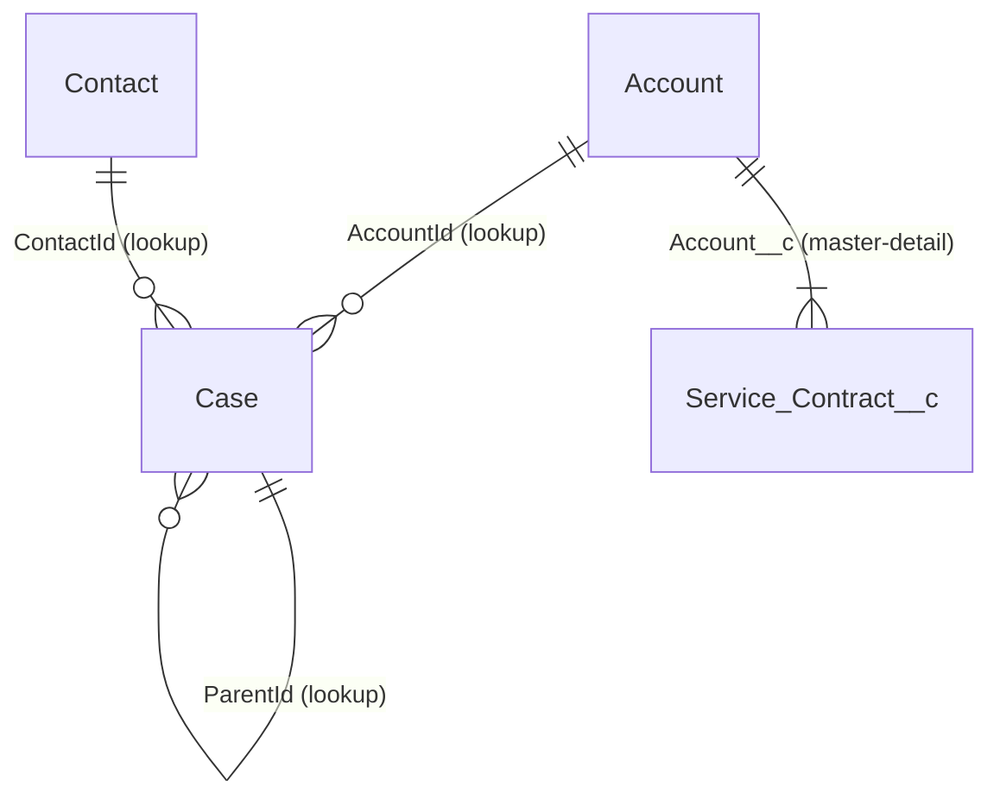

# Worked Examples — Data Model Documentation

Data model documentation is **generated**, not written. The deliverable is therefore never the
spreadsheet — it is the *generator* plus the reviewed record it produces. Everything below is filled
in for one scenario so an agent can copy, swap the object list, and re-run.

**Scenario used throughout:** a Service Cloud org, three objects in scope — `Account` (standard, heavily
customised), `Case` (standard), and `Service_Contract__c` (custom, master-detail child of Account).
The output feeds `agents/data-model-reviewer/AGENT.md` (its domain-graph section) and
`agents/field-impact-analyzer/AGENT.md` (its Step 1 field-shape lookup).

**Which generator to reach for**

| Generator | Gives you | Does not give you |
|---|---|---|
| 1. Apex describe → CSV | Runtime shape: type, length, required, unique, external ID, formula flag, relationship target | `description`, created date, formula text on all API paths |
| 2. REST `/describe` → flattened rows | Same shape, no Apex, works from CI with a token | Same omissions as above |
| 3. Mermaid ER map from `getReferenceTo()` | Edge list with real cardinality | Layout, styling, notation choices |
| 4. Metadata retrieve → field inventory | `description`, `inlineHelpText`, `businessOwnerUser`, `securityClassification`, `businessStatus`, formula text | Anything the running user cannot retrieve; non-customisable standard fields |
| 5. Data dictionary record | The reviewed, owned artefact | Itself — it is assembled from 1–4 |
| 6. Two-snapshot diff | What changed between orgs | Why it changed |

Generators 1–3 read the org's **runtime** view. Generator 4 reads the **source** view. They disagree,
and the disagreements are the point — see `references/gotchas.md`.

---

## 1. Apex anonymous script — field inventory CSV

Run in Developer Console → Debug → Open Execute Anonymous Window, with the log level for Apex Code at
`ERROR` or finer. Shaped from the `describeSObjects` example in the Apex Developer Guide
(apexdev.txt L10959–L10978), which is the source for the `res.fields.getMap()` iteration idiom.

```apex
// Field inventory CSV. Paste the debug output (everything after the marker) into a .csv file.
// Batch the object list: the describeSObjects() call is capped at 100 objects returned
// (Salesforce App Limits Cheat Sheet, SOAP API Call Limits).
List<String> objectsInScope = new List<String>{
    'Account', 'Case', 'Service_Contract__c'
};

List<String> rows = new List<String>{
    'object,apiName,label,type,length,required,unique,externalId,isCustom,isFormula,'
    + 'referenceTo,relationshipName,relationshipOrder,inlineHelpText'
};

for (Schema.DescribeSObjectResult objDesc : Schema.describeSObjects(objectsInScope)) {
    for (Schema.SObjectField fToken : objDesc.fields.getMap().values()) {
        Schema.DescribeFieldResult d = fToken.getDescribe();

        // getReferenceTo() returns >1 entry only when isNamePointing() is true (polymorphic).
        List<String> parents = new List<String>();
        for (Schema.SObjectType parentType : d.getReferenceTo()) {
            parents.add(parentType.getDescribe().getName());
        }

        String labelCsv = d.getLabel() == null
            ? '' : '"' + d.getLabel().replace('"', '""') + '"';
        String helpCsv = d.getInlineHelpText() == null
            ? '' : '"' + d.getInlineHelpText().replace('"', '""').replace('\n', ' ') + '"';

        rows.add(String.join(new List<String>{
            objDesc.getName(),
            d.getName(),
            labelCsv,
            String.valueOf(d.getType()),
            String.valueOf(d.getLength()),
            String.valueOf(!d.isNillable()),      // required == not nillable
            String.valueOf(d.isUnique()),
            String.valueOf(d.isExternalID()),
            String.valueOf(d.isCustom()),
            String.valueOf(d.isCalculated()),     // true == custom formula field
            String.join(parents, '|'),
            d.getRelationshipName() == null ? '' : d.getRelationshipName(),
            d.getReferenceTo().isEmpty() ? '' : String.valueOf(d.getRelationshipOrder()),
            helpCsv
        }, ','));
    }
}

System.debug(LoggingLevel.ERROR, '\n---BEGIN-INVENTORY---\n' + String.join(rows, '\n'));
```

**What this script cannot emit, and why it matters more than what it can**

| Column a data dictionary needs | Available from describe? | Where it actually comes from |
|---|---|---|
| `description` (the field's documented purpose) | **No** — `Schema.DescribeFieldResult` has no `getDescription()` method (Apex Reference Guide, DescribeFieldResult Methods, L190542–L190672 — the complete method list, with no getDescription among them) | Metadata API `<description>` — generator 4 |
| `createdDate` / who added the field | **No** — no such method on `DescribeFieldResult` | Tooling `CustomField`, or the org's source-control history |
| `businessOwnerUser`, `securityClassification`, `businessStatus` | **No** | Metadata API `CustomField` — generator 4, and `security/data-classification-labels` |
| `inlineHelpText` | Yes — `getInlineHelpText()` | describe or metadata; they should agree |
| Formula text | `getCalculatedFormula()` returns it in **Apex** describe | Metadata API `<formula>` is the portable source |

That first row is the single most important fact in this skill: **the describe API returns the field's
shape, never its documentation.** Any inventory built only from describe is structurally incapable of
answering "what is this field for", which is the question the dictionary exists to answer.

---

## 2. REST describe + flatten

For CI, or when Apex execution is not available. The endpoint is
`/services/data/vXX.X/sobjects/sObject/describe/` (REST API Developer Guide, sObject Describe
resource, api_rest.txt L8294–L8300).

UNVERIFIED (2026-09-04): the `sf` CLI command and flag spellings below (`sf api request rest`,
`sf sobject list --sobject`, `sf sobject describe --sobject`, `sf project retrieve start --manifest`,
`--target-org`, `--output-dir`, `--use-tooling-api`) are not documented in any of the extracted
Salesforce PDFs — the CLI Command Reference is a separate publication. They were confirmed against
`sf --help` on the locally installed CLI, version 2.149.9. Re-check with `sf <command> --help` before
scripting them into CI; the CLI ships breaking flag renames more often than the platform does.

```bash
sf api request rest "/services/data/v62.0/sobjects/Service_Contract__c/describe" \
  --target-org prod > describe_Service_Contract__c.json

# The object list to iterate (--sobject takes standard | custom | all):
sf sobject list --sobject custom --target-org prod --json > objects_custom.json

# Single-object equivalent without the raw REST call:
sf sobject describe --sobject Service_Contract__c --target-org prod > describe_Service_Contract__c.json
```

Flatten one describe payload to the same CSV columns as generator 1:

```bash
jq -r '
  .name as $obj
  | .fields[]
  | [ $obj, .name, .label, .type, (.length|tostring),
      ((.nillable|not)|tostring), (.unique|tostring), (.externalId|tostring),
      (.custom|tostring), (.calculated|tostring),
      ((.referenceTo // []) | join("|")),
      (.relationshipName // ""),
      (.inlineHelpText // "")
    ] | @csv
' describe_Service_Contract__c.json
```

Python equivalent, when you want to walk a whole directory of describe payloads:

```python
import csv, json, pathlib, sys

COLS = ["object", "apiName", "label", "type", "length", "required", "unique",
        "externalId", "isCustom", "isFormula", "referenceTo", "relationshipName",
        "inlineHelpText"]

w = csv.writer(sys.stdout)
w.writerow(COLS)
for p in sorted(pathlib.Path(".").glob("describe_*.json")):
    d = json.loads(p.read_text(encoding="utf-8"))
    for f in d.get("fields", []):
        w.writerow([
            d.get("name", ""), f.get("name", ""), f.get("label", ""), f.get("type", ""),
            f.get("length", 0), not f.get("nillable", True), f.get("unique", False),
            f.get("externalId", False), f.get("custom", False), f.get("calculated", False),
            "|".join(f.get("referenceTo") or []),
            f.get("relationshipName") or "",
            f.get("inlineHelpText") or "",
        ])
```

**Snapshot hygiene.** The same resource accepts `If-Modified-Since` with a date in
`EEE, dd MMM yyyy HH:mm:ss z` format and returns `304 Not Modified` with **no response body** when the
object's metadata has not changed since that date (api_rest.txt L2626–L2645). A nightly snapshot job
should treat 304 as "no drift on this object" rather than as a failure — and must not overwrite the
stored payload with an empty body.

---

## 3. ER map — Mermaid `erDiagram` from `getReferenceTo()`

The edge list is derived, not drawn by hand. Cardinality comes from three describe methods, each
documented in the Apex Reference Guide's DescribeFieldResult method list:

| Describe method | Documented meaning | Use in the ER map |
|---|---|---|
| `getReferenceTo()` | list of parent object types; >1 entry only when `isNamePointing()` is true (L190587–L190589) | the edge's target(s) |
| `isNillable()` | false means the object cannot be saved without a value (L190657–L190658) | `\|\|--\|{` (required) vs `\|\|--o{` (optional) |
| `isCascadeDelete()` | true when the child is deleted with the parent (L190612) | marks the master-detail edges |

```apex
// Emits Mermaid erDiagram edges. Paste the output into a fenced mermaid block.
List<String> objectsInScope = new List<String>{ 'Account', 'Case', 'Service_Contract__c' };
Set<String> inScope = new Set<String>(objectsInScope);

List<String> edges = new List<String>();
for (Schema.DescribeSObjectResult objDesc : Schema.describeSObjects(objectsInScope)) {
    for (Schema.SObjectField fToken : objDesc.fields.getMap().values()) {
        Schema.DescribeFieldResult d = fToken.getDescribe();
        if (d.getReferenceTo().isEmpty()) { continue; }

        // Polymorphic lookups get one edge per target, tagged, because ER notation
        // cannot express "either of these parents".
        Boolean polymorphic = d.isNamePointing();
        String connector = d.isNillable() ? '||--o{' : '||--|{';
        String kind = d.isCascadeDelete() ? 'master-detail' : 'lookup';

        for (Schema.SObjectType parentType : d.getReferenceTo()) {
            String parent = parentType.getDescribe().getName();
            if (!inScope.contains(parent)) { continue; }   // drop out-of-scope edges
            edges.add('    ' + parent + ' ' + connector + ' ' + objDesc.getName()
                + ' : "' + d.getName() + ' (' + kind
                + (polymorphic ? ', polymorphic' : '') + ')"');
        }
    }
}
System.debug(LoggingLevel.ERROR, '\nerDiagram\n' + String.join(edges, '\n'));
```

Rendered result for the scenario:



**Boundary.** This skill owns the *extraction* — turning describe output into a correct edge list with
honest cardinality. Diagram notation, layout, subgraphing, colour conventions and the PlantUML variant
belong to `architect/salesforce-erd-and-diagramming`; hand the edge list to that skill rather than
restyling it here.

**Two things the emitter deliberately does not hide:** an out-of-scope parent silently drops its edge
(so the map is only as complete as `objectsInScope`), and a polymorphic field emits one edge per
target with a `polymorphic` tag rather than a single line — because a reader who sees one line will
conclude, wrongly, that the field has one parent.

---

## 4. Retrieve-based inventory — the documentation columns

Only the source view carries `description`, ownership and classification. The `CustomObject` metadata
type is how you reach both custom objects and customisations of standard objects — "You can also use
this metadata type to work with customizations of standard objects, such as accounts" (api_meta.txt
L41900–L41903).

```xml
<?xml version="1.0" encoding="UTF-8"?>
<Package xmlns="http://soap.sforce.com/2006/04/metadata">
    <types>
        <members>Account</members>
        <members>Case</members>
        <members>Service_Contract__c</members>
        <name>CustomObject</name>
    </types>
    <version>62.0</version>
</Package>
```

```bash
sf project retrieve start --manifest manifest/data-dictionary.xml --target-org prod
```

UNVERIFIED (2026-09-04): `sf project retrieve start --manifest` / `--target-org`, and the source-format
decomposition of a retrieved object into `objects/<Object>/fields/<Field>.field-meta.xml`, are sf CLI
behaviours, not Metadata API behaviours — the guide documents the wire format as a single `.object` file
per object (api_meta.txt L41916–L41918). Neither the flags nor the decomposition appear in the extracted
PDFs; both were confirmed against `sf project retrieve start --help` on CLI 2.149.9. If your project uses
metadata (MDAPI) format rather than source format, every field lives inside one `.object` file and the
flattener below needs a different walk.

Standard objects must be listed by name. The Metadata API guide is explicit: "you can't use an
asterisk wildcard to work with all standard objects; each standard object must be specified by name",
and a `<members>*</members>` manifest "can be used to retrieve or deploy all custom objects, but not
all standard objects" (api_meta.txt L2178–L2179 and L2193).

Flatten the retrieved field files. In sf CLI source format each field is a separate
`objects/<Object>/fields/<Field>.field-meta.xml`:

```python
# python3 field_docs.py force-app/main/default/objects > field_docs.csv
import csv, pathlib, sys, xml.etree.ElementTree as ET

NS = {"m": "http://soap.sforce.com/2006/04/metadata"}
COLS = ["object", "apiName", "label", "type", "description", "inlineHelpText",
        "businessOwnerUser", "businessStatus", "securityClassification", "complianceGroup",
        "formula", "referenceTo", "relationshipName"]

def text(root, tag):
    el = root.find(f"m:{tag}", NS)          # never `a.find(x) or a.find(y)` — a leaf Element is falsy
    if el is None:
        el = root.find(tag)
    return (el.text or "").strip() if el is not None and el.text else ""

root_dir = pathlib.Path(sys.argv[1])
w = csv.writer(sys.stdout)
w.writerow(COLS)
for p in sorted(root_dir.rglob("*.field-meta.xml")):
    r = ET.parse(p).getroot()
    obj = p.parent.parent.name
    w.writerow([obj, text(r, "fullName"), text(r, "label"), text(r, "type"),
                text(r, "description"), text(r, "inlineHelpText"),
                text(r, "businessOwnerUser"), text(r, "businessStatus"),
                text(r, "securityClassification"),
                "|".join(e.text or "" for e in r.findall("m:complianceGroup", NS)),
                text(r, "formula"), text(r, "referenceTo"), text(r, "relationshipName")])
```

The last four documentation columns are **native `CustomField` metadata fields**, not spreadsheet
inventions — `businessOwnerUser` / `businessOwnerGroup` (API 45.0+), `businessStatus` with values
`Active`, `DeprecateCandidate`, `Hidden` (API 45.0+), `securityClassification` with values `Public`,
`Internal`, `Confidential`, `Restricted`, `MissionCritical` (API 45.0+), and `complianceGroup` as a
multipicklist over `CCPA`, `COPPA`, `GDPR`, `HIPAA`, `PCI`, `PII` (API 47.0+) — api_meta.txt L43308,
L43313–L43321, L43614–L43622, L43334–L43342. Set them once and the dictionary's owner and
classification columns become deployable, diffable metadata instead of a spreadsheet that drifts.
The value sets and how to govern them belong to `security/data-classification-labels`; this skill only
consumes them.

---

## 5. The data dictionary record

The reviewed artefact. `templates/data-dictionary.yaml` is the empty shape; this is it filled in.
`scripts/check_data_model_documentation.py --file <path>` lints it.

```yaml
# data-dictionary.yaml — reviewed record for the Service Cloud domain
version: 1
generated_from:
  describe_snapshot: snapshots/2026-09-04/describe/
  metadata_retrieve: snapshots/2026-09-04/force-app/main/default/objects/
  org_alias: prod
objects:
  - object: Account
    label: Account
    type: standard
    owner: revenue-operations@example.com
    classification: Confidential
    record_volume: 412870
    last_reviewed: 2026-09-04
    review_cadence: quarterly
    notes: >-
      Salesforce-managed object. Standard fields are documented from the Object Reference,
      not from the retrieve — the retrieve returns customisations only.
    fields:
      - api_name: ERP_Customer_ID__c
        label: ERP Customer ID
        type: Text(20)
        required: false
        external_id: true
        classification: Internal
        owner: integration-platform@example.com
        business_status: Active
        description: >-
          Upsert key for the nightly SAP customer sync. Never edit manually; a changed value
          orphans the SAP-side record and the next sync re-creates the Account.
      - api_name: Credit_Hold__c
        label: Credit Hold
        type: Checkbox
        required: false
        external_id: false
        classification: Internal
        owner: revenue-operations@example.com
        business_status: Active
        description: >-
          Set by the credit-check Flow. Blocks Opportunity close via validation rule
          VR_Block_Close_On_Credit_Hold.

  - object: Service_Contract__c
    label: Service Contract
    type: custom
    owner: service-operations@example.com
    classification: Restricted
    record_volume: 88214
    last_reviewed: 2026-09-04
    review_cadence: quarterly
    fields:
      - api_name: Account__c
        label: Account
        type: MasterDetail(Account)
        required: true
        external_id: false
        classification: Internal
        owner: service-operations@example.com
        business_status: Active
        description: >-
          Master-detail to Account. Cascade delete: removing the Account removes every
          contract. Relationship name Service_Contracts, used by the roll-up on Account.
      - api_name: Legacy_Tier__c
        label: Legacy Tier
        type: Picklist
        required: false
        external_id: false
        classification: Internal
        owner: service-operations@example.com
        business_status: DeprecateCandidate
        description: ""
```

**How the required keys are chosen, not invented**

| Key | Why it is required | Source |
|---|---|---|
| `owner` | A field with no owner has nobody to ask before it changes; the platform models this as `businessOwnerUser` | api_meta.txt L43308 |
| `classification` | Mirrors `securityClassification`; the allowed values are the platform's five, so the record can be deployed back | api_meta.txt L43614–L43622 |
| `business_status` | Mirrors `businessStatus`; `DeprecateCandidate` is how the org marks a field for removal | api_meta.txt L43313–L43321 |
| `record_volume` | Sets the archival and LDV conversation; captured as `SELECT COUNT() FROM <Object>` at snapshot time | — |
| `last_reviewed` + `review_cadence` | A dictionary with no review date is indistinguishable from an abandoned one | practice |

`Legacy_Tier__c` above carries an empty `description` on purpose: the checker emits a WARN, not an
error, so an in-progress dictionary still passes while the debt stays visible. Feed the WARN list to
the field owner, not to the admin who ran the export.

Record volume, per object:

```sql
SELECT COUNT() FROM Service_Contract__c
```

**Downstream consumers.** `agents/data-model-reviewer/AGENT.md` reads this record for the ERD and
field-dictionary shape its domain-graph section must match (its Mandatory Reads item 22 cites this
skill for exactly that). `agents/field-impact-analyzer/AGENT.md` treats the `owner` and
`business_status` values as inputs to its blast-radius score — it does **not** generate this record,
and this skill does **not** score impact.

---

## 6. Diff two snapshots — sandbox vs production

Documentation is only true on the day it was generated. The diff is what makes it a control.

```bash
# One snapshot per org, same manifest, same API version, same directory shape.
# --output-dir spelling: sf CLI 2.149.9, see the UNVERIFIED note in section 4.
for ORG in prod uat; do
  sf project retrieve start --manifest manifest/data-dictionary.xml \
    --target-org "$ORG" --output-dir "snapshots/$(date +%F)/$ORG"
done

diff -ru "snapshots/$(date +%F)/uat/objects" "snapshots/$(date +%F)/prod/objects"
```

Field-level summary rather than an XML diff — reuse generator 4's flattener on both trees and compare
the documentation columns only:

```bash
python3 field_docs.py "snapshots/$(date +%F)/uat/objects"  | sort > uat.csv
python3 field_docs.py "snapshots/$(date +%F)/prod/objects" | sort > prod.csv
diff uat.csv prod.csv
```

**Read the diff correctly.** A field present in UAT and absent in prod is not necessarily undeployed
drift — it can equally be a field the *running user* cannot see in prod, because a retrieve is scoped
by the retrieving user's permissions. Rule: run both snapshots as the same permission profile, and
record which one in the dictionary's `generated_from` block, or the diff is uninterpretable.

The interpretation of drift — which side is authoritative, what is safe to deploy, how to build a
destructive-changes manifest — belongs to `devops/metadata-diff-between-sandboxes`. This skill stops
at producing two comparable snapshots and a field-level delta.

---

## Anti-pattern: shipping the export as the dictionary

A CSV dumped from generator 1 or 2 has every column a describe can produce and none of the columns
that make a dictionary useful — no owner, no classification, no purpose, no review date, and a
`description` column that is either absent or empty. It looks complete because it has 400 rows. It is
handed to an integration partner, who reads `Legacy_Tier__c` as a live field and maps to it.

The export is an input. The record in section 5 is the deliverable, and it is not finished until every
object has an owner and every field row has a description or an accepted WARN.
