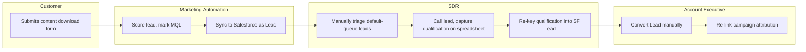
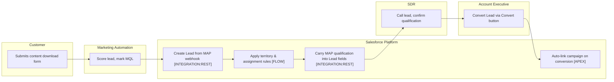
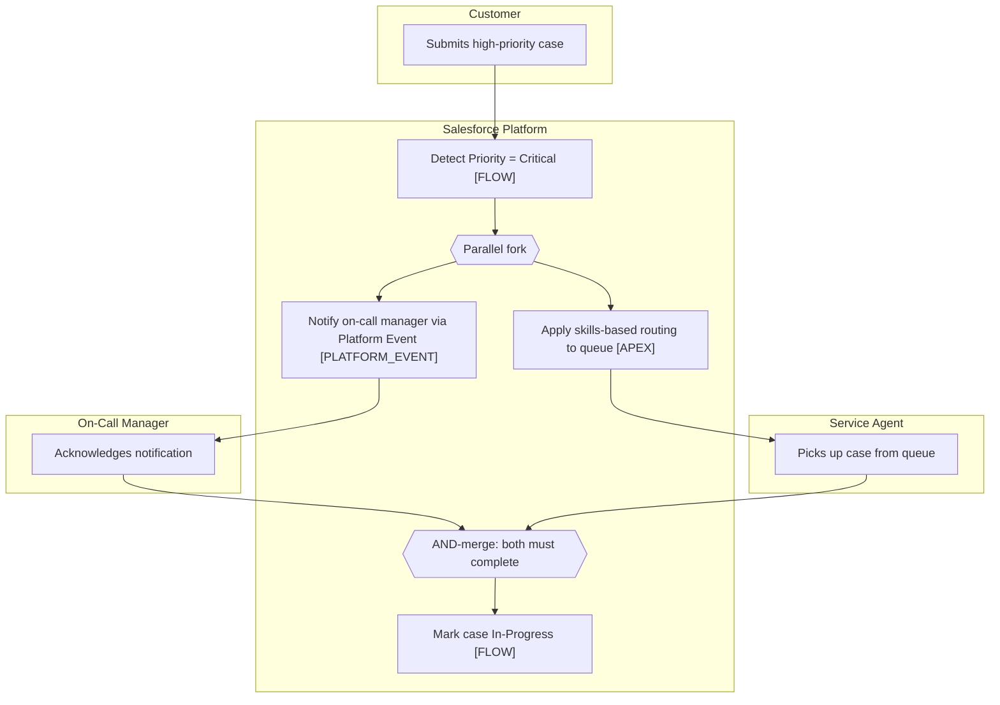
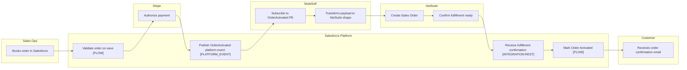

# Examples — Process Flow As-Is To-Be

Three worked examples covering the canonical patterns this skill produces.

---

## Example 1: Lead-to-Opportunity (B2B SaaS)

**Context:** A 200-rep B2B SaaS company runs a lead-to-opportunity process where MQLs are routed by territory, qualified by SDRs, and converted to opportunities by AEs. The current process is a mix of MAP automation, manual reassignment, and rep-driven conversion. The team needs an As-Is and To-Be before the next CRM sprint.

**Problem:** The As-Is has three pain points: (1) MQLs get stuck in a default queue when the territory rules miss, (2) SDRs re-key qualification answers that the MAP already collected, (3) AEs convert leads inconsistently, sometimes losing the campaign attribution.

**Solution — As-Is swim-lane (mermaid):**

**Solution — To-Be swim-lane with automation tiers:**

**Automation candidates (3 of them):**

| Step | Tier | Decision-Tree Branch | Recommended Agent |
|---|---|---|---|
| Apply territory & assignment rules | `[FLOW]` | automation-selection.md Q2 → Before-save record-triggered Flow on Lead | /build-flow |
| Carry MAP qualification into Lead fields | `[INTEGRATION:REST]` | automation-selection.md Q11 → REST API + Apex custom endpoint | /build-agentforce-action (paired with object-designer for Lead field design) |
| Auto-link campaign on conversion | `[APEX]` | automation-selection.md Q3 → Apex (needs custom logic on standard Lead.convertLead) | /refactor-apex (or trigger-consolidator if a Lead trigger exists) |

**Manual residue:** SDR call to confirm qualification stays manual — this is judgement work, not automatable.

**Why it works:** Annotating each To-Be step with a tier resolves the "Flow vs Apex" routing argument before build. The campaign-attribution step is the kind that LLMs want to put into a Flow, but the conversion event needs Apex because the standard Lead conversion does not expose campaign-relink as a Flow-callable action.

---

## Example 2: Case Escalation with Parallel SLA Paths

**Context:** Service Cloud org with a tiered SLA process. Critical cases must trigger two parallel actions simultaneously: a manager-notification SLA path (15-minute response) and a case-routing SLA path (30-minute first-response). Both must complete before the case is considered "in-progress".

**Problem:** The As-Is is a sequential flow that runs notification first, then routing. This adds latency and breaks the 15-minute notification SLA when routing takes longer than expected.

**Solution — To-Be with parallel paths:**

**Exception paths documented:**

| Decision / Handshake | Branch | Next Step |
|---|---|---|
| Detect Priority = Critical | non-critical | standard routing (out of scope) |
| Notify on-call manager | timeout > 15min | escalate to backup manager `[FLOW]` |
| Apply skills-based routing | no agent available | overflow queue with `[APPROVAL]` for off-hours dispatch |
| AND-merge | manager ack but no agent | hold case In-Triage `[FLOW]` |

**Automation candidates:** 4 (two `[FLOW]`, one `[APEX]`, one `[PLATFORM_EVENT]`).

**Why it works:** The fork / AND-merge is explicit. The build team knows the merge requires a wait condition (Platform Event subscriber that increments a counter on the case). Without the merge documented, builders typically implement only the fork and the SLA breach goes unnoticed.

---

## Example 3: Order Fulfillment with Integration Swim Lane

**Context:** B2B order intake. Sales books an order in Salesforce; the order must propagate to NetSuite for fulfillment, and a payment authorization is captured via Stripe. Three integrations, three named lanes.

**Problem:** The As-Is has Sales Ops re-keying orders into NetSuite and emailing finance to capture payment. The To-Be eliminates re-keying and gives Stripe the payment-capture role, but the team initially mapped this with one "Integration" lane that hid which system was responsible for which step.

**Solution — Three named integration lanes:**

**Why three lanes:** Stripe, MuleSoft, and NetSuite each have distinct handshake steps. Lumping them into one "Integration" lane would obscure that MuleSoft is the orchestrator (subscribing to the PE) while NetSuite is the system of record for fulfillment and Stripe is the payment authority. The build team needs to know which named credential, which authentication scheme, and which retry policy applies per integration — and that information is keyed off the lane name.

**Automation candidates:** 5 — two `[FLOW]`, one `[PLATFORM_EVENT]`, one `[INTEGRATION:REST]`, plus the Stripe `[INTEGRATION:REST]` not shown as a tagged step (it is initiated by Salesforce but executed in Stripe — the SF step that initiates it would be tagged).

**Customer lane:** Present and explicit. The customer email confirmation is the end state. Forgetting this lane is the most common B2B mapping mistake.

---

## Anti-Pattern: To-Be Without an As-Is

**What practitioners do:** Skip the As-Is entirely and produce only a To-Be diagram on the assumption that "we know what we want".

**What goes wrong:** The To-Be loses justification. Every step in the To-Be should map to either a pain point in the As-Is (which the To-Be eliminates) or a new business capability. Without the As-Is, there is nothing to anchor the To-Be against, and stakeholders cannot evaluate whether the proposed change actually solves their problems.

**Correct approach:** Always produce both. Even a 10-minute As-Is is better than no As-Is. The pain-point annotations on the As-Is are what justify the automation candidates in the To-Be.
