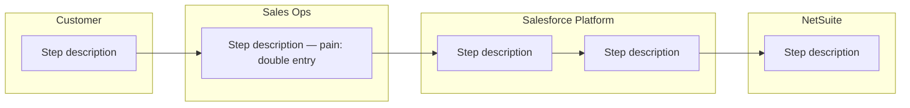
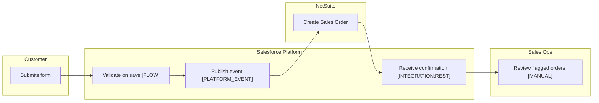

# Process Map — As-Is / To-Be Template

Use this template to produce a versioned, swim-lane-disciplined process map. Output is paired Mermaid diagrams (As-Is + To-Be) plus a machine-readable JSON handoff that downstream agents (`/build-flow`, `/build-agentforce-action`, `/design-object`) consume.

---

## Scope

- **Process ID:** (slug, e.g. `order-intake-2026q2`)
- **Process owner:** (named role)
- **Start trigger:** (concrete event)
- **End state:** (concrete state)
- **Actors:** (4–7 lanes — list each here before diagramming)
  - Human roles:
  - Salesforce platform: yes (always one lane)
  - Named integrations:
  - Customer / external counterparty: yes / no — if the customer touches the process at all, this is `yes`

---

## As-Is Swim Lane (Mermaid)



### As-Is Pain Points

| Step ID | Actor | Description | Pain Points |
|---|---|---|---|
| asis-001 | (role) | (action) | (double entry / waiting / manual lookup / missing audit / etc) |

---

## To-Be Swim Lane (Mermaid)



### Automation Candidate Table

| Step ID | Actor | Description | Tier | Decision-Tree Branch | Recommended Agent |
|---|---|---|---|---|---|
| tobe-001 | Salesforce Platform | Validate on save | `[FLOW]` | automation-selection.md Q2 → Before-save Flow | /build-flow |
| tobe-002 | Salesforce Platform | Publish OrderActivated event | `[PLATFORM_EVENT]` | automation-selection.md Q12 → Platform Event | /build-flow (subscriber) |
| tobe-003 | Salesforce Platform | Receive fulfillment confirmation | `[INTEGRATION:REST]` | automation-selection.md Q11 → REST API + Apex endpoint | /build-agentforce-action |

### Manual Residue Table

| Step ID | Actor | Description | Reason for staying manual |
|---|---|---|---|
| manual-001 | Sales Ops | Review flagged orders > $250k | Regulatory: financial threshold requires human sign-off |

### Exception Path Catalogue

| Decision / Handshake | Branch (condition) | Next Step / Behaviour |
|---|---|---|
| credit-check | approved | tobe-002 |
| credit-check | rejected | manual-001 |
| credit-check | credit_service_timeout | tobe-fallback-001 (retry with backoff, then manual) |

---

## Handoff JSON

This JSON is the canonical machine-readable output. It must validate against `scripts/check_process_map.py`.

```json
{
  "process_id": "order-intake-2026q2",
  "version": "1.0.0",
  "scope": {
    "start_trigger": "Customer submits order form",
    "end_state": "Order activated in NetSuite and customer notified",
    "actors": [
      "Customer",
      "Salesforce Platform",
      "Sales Ops",
      "NetSuite",
      "MuleSoft",
      "Stripe"
    ]
  },
  "as_is_steps": [
    {
      "step_id": "asis-001",
      "actor": "Sales Ops",
      "description": "Manually re-keys order from email into Salesforce",
      "pain_points": ["double entry", "no audit trail"]
    }
  ],
  "to_be_steps": [
    {
      "step_id": "tobe-001",
      "actor": "Salesforce Platform",
      "description": "Validate order on save",
      "automation_tier": "FLOW",
      "decision_tree_branch": "automation-selection.md Q2 → Before-save record-triggered Flow",
      "recommended_agents": ["build-flow"]
    },
    {
      "step_id": "tobe-002",
      "actor": "Salesforce Platform",
      "description": "Publish OrderActivated platform event",
      "automation_tier": "PLATFORM_EVENT",
      "decision_tree_branch": "automation-selection.md Q12 → Platform Event (decoupled within Salesforce)",
      "recommended_agents": ["build-flow"]
    }
  ],
  "manual_residue": [
    {
      "step_id": "manual-001",
      "actor": "Sales Ops",
      "description": "Review flagged orders > $250k",
      "reason": "regulatory"
    }
  ],
  "exception_paths": [
    {
      "decision_id": "credit-check",
      "branches": [
        {"condition": "approved", "next_step": "tobe-002"},
        {"condition": "rejected", "next_step": "manual-001"},
        {"condition": "credit_service_timeout", "next_step": "tobe-fallback-001"}
      ]
    }
  ],
  "open_questions": []
}
```

---

## Tier Enum (do not invent values)

```
FLOW            — record-triggered, screen, or autolaunched Flow
APEX            — Apex trigger, service, batch, or queueable
APPROVAL        — Salesforce Approval Process
PLATFORM_EVENT  — Platform Event publish or CDC subscriber
INTEGRATION     — callout / inbound API / MuleSoft / Pub/Sub (sub-tier optional: REST, BULK, PE, CDC, PUBSUB, CONNECT, MULESOFT)
MANUAL          — intentionally not automated; requires reason in manual_residue
OPEN            — tier could not be resolved; route to open_questions
```

---

## Validation Hooks

After filling this template, run:

```bash
python3 scripts/check_process_map.py --map path/to/process-map.json
```

The checker enforces:

- Every `to_be_steps[].automation_tier` is in the enum
- Every decision in `exception_paths` has ≥2 branches
- Every actor in `as_is_steps` and `to_be_steps` is declared in `scope.actors`
- Every actor declared in `scope.actors` appears in either `as_is_steps` or `to_be_steps`
- Every `MANUAL` step has a `reason` in `manual_residue`
- Every integration handshake has at least one timeout / fallback branch
