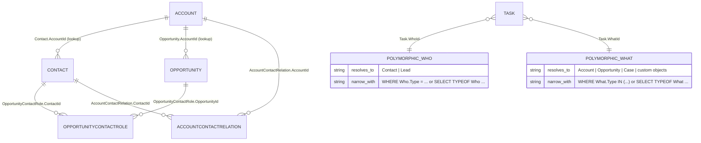

# Examples — Salesforce ERD and Diagramming

## Example 1: A Mermaid ERD that states its own scope and handles polymorphism honestly

**Context:** An architect needs a Sales Cloud ERD that a data-migration team can work from, covering Account, Contact,
Opportunity, the contact-role junction, and Activities.

**Problem:** Generated ERDs get two things wrong in the same file. They draw `Task.WhatId` as a single edge to whatever
object the generator saw first — but "the `Who` relationship field of a `Task` can be a `Contact` or a `Lead`", and
`What` is broader still. And they carry no provenance, so a reader cannot tell whether an absent object is missing from
the org or missing from the manifest.

**Solution:** Emit the scope header from the retrieval job, model polymorphic fields as an annotated node rather than a
relationship line, and include the junction objects.

````markdown

````

The companion query belongs next to the diagram, because it is what makes the polymorphic node actionable:

```apex
// Filter form — narrow by the Type qualifier
List<Event> byType = [SELECT Description FROM Event
                      WHERE What.Type IN ('Account', 'Opportunity') WITH USER_MODE];

// Projection form — different fields per referenced type
List<Event> byTypeOf = [SELECT TYPEOF What
                            WHEN Account THEN Phone
                            WHEN Opportunity THEN Amount
                        END
                        FROM Event WITH USER_MODE];
```

**Why it works:** The header answers "is this current and complete?" without a conversation — manifest, API version,
retrieval date, and an explicit exclusion. The polymorphic nodes stop the diagram asserting something false, and the
`AccountContactRelation` and `OpportunityContactRole` rows answer the two questions that always come up in review and
that a core-objects-only ERD cannot.

---

## Example 2: A regeneration job that fails when the diagram drifts

**Context:** The ERD is committed to the repo and expected to stay accurate across releases.

**Problem:** A diagram regenerated on a schedule looks maintained. If the manifest is pinned to an old API version, the
regeneration reproduces a frozen view — "The API version that the deployment uses is the API version that's specified
in `package.xml`", and retrieval honours the same version — so a field added last release never appears and nothing
errors.

**Solution:** Regenerate on metadata change, diff against the committed file, and fail the build on drift *and* on a
stale manifest version.

```yaml
# .github/workflows/erd.yml (excerpt)
on:
  pull_request:
    paths:
      - 'force-app/main/default/objects/**'
      - 'manifest/erd.xml'

jobs:
  erd:
    steps:
      - name: Fail if the manifest API version trails the org
        run: |
          MANIFEST_VERSION=$(grep -oE '<version>[0-9]+\.0</version>' manifest/erd.xml \
                             | grep -oE '[0-9]+\.0')
          echo "manifest API version: $MANIFEST_VERSION"
          test "$MANIFEST_VERSION" = "67.0" \
            || { echo "::error::manifest/erd.xml is pinned to $MANIFEST_VERSION; \
                 the ERD will omit anything newer"; exit 1; }

      - name: Retrieve and regenerate
        run: |
          sf project retrieve start --manifest manifest/erd.xml --target-org devhub
          python3 scripts/generate_erd.py \
            --source force-app/main/default/objects \
            --api-version "$MANIFEST_VERSION" \
            --out docs/diagrams/erd-sales.md

      - name: Fail on drift
        run: |
          git diff --exit-code docs/diagrams/erd-sales.md \
            || { echo "::error::ERD is stale — commit the regenerated diagram"; exit 1; }
```

**Why it works:** Two failure modes are caught rather than one. Drift fails loudly, which is the easy half. The version
check catches the quiet half — a job that runs green forever while producing a diagram of the org as an old API version
sees it. Printing `--api-version` into the generated header closes the loop, so the artifact carries the provenance the
job just verified.

---

## Anti-Pattern: The "current state" diagram with no provenance

**What practitioners do:** Export a diagram from a drawing tool, paste it into a slide deck and a wiki page, and label
it "Current State — Data Model".

**What goes wrong:** Nothing, on the day it is made. The failure is cumulative: within two releases the diagram
disagrees with the org, and because it carries no date, no manifest, and no API version, no reader can tell which parts
are stale. It then gets used as the input to a migration plan, where the missing junction objects and the invented
`WhatId` edge become schedule risk. Diagrams that cannot be regenerated do not decay visibly — they decay while looking
authoritative.

**Correct approach:** Version-controlled diagram source, regenerated from metadata, with the header block from Example
1 and the CI gate from Example 2. Keep drawing tools for the executive rendering, generate that rendering from the same
source, and never let the hand-drawn version be the only copy of a relationship. Where a component type cannot be
retrieved at all — the Metadata Coverage report is the check — annotate the object on the diagram rather than omitting
it, because an omission is indistinguishable from "does not exist".
